# Livre de Mémoire (Version longue ~50 pages) — Plateforme LMS E-Learning Programming

**Type :** Mémoire académique en 3 chapitres (synthèse des 6 parties demandées).  
**Projet :** Conception et développement d’une plateforme LMS orientée apprentissage de la programmation.  
**Version :** 2.0 (édition longue).  
**Langue :** Français.

---

## Préambule

Ce document constitue une version longue destinée à une impression académique. La pagination finale dépendra de la mise en forme (A4, police 12, interligne 1.5, marges standard, insertion de schémas/figures/tableaux). Le contenu textuel est volontairement détaillé afin de soutenir un rendu de l’ordre de 50 pages une fois enrichi des figures UML, annexes techniques, captures de maquettes, scripts SQL et tableaux de tests.

L’approche adoptée est une structuration en **trois chapitres** :
1. Introduction générale + étude de l’existant + analyse des besoins.
2. Conception + réalisation / implémentation.
3. Tests + validation + conclusion et perspectives.

Cette organisation couvre intégralement les six parties du plan initial tout en gardant une narration continue, pédagogique et exploitable lors d’une soutenance.

---

# CHAPITRE 1 — INTRODUCTION GÉNÉRALE, ÉTUDE DE L’EXISTANT ET ANALYSE DES BESOINS

## 1.1 Contexte général

La transformation numérique de l’enseignement a profondément modifié les usages pédagogiques. Les apprenants recherchent des formats flexibles, accessibles et interactifs, tandis que les établissements et organismes de formation doivent concilier qualité pédagogique, coûts d’exploitation et gouvernance des données. Dans le domaine de la programmation, cette transformation est encore plus visible : les cycles d’apprentissage sont courts, les technologies évoluent rapidement, et les compétences attendues sur le marché changent en continu.

Dans ce contexte, les plateformes LMS représentent une réponse structurante. Elles centralisent contenus, évaluations, suivi et administration. Toutefois, de nombreuses solutions généralistes ne répondent pas complètement aux besoins d’un apprentissage pratique du code : soit elles sont très complètes mais lourdes à administrer, soit elles sont ergonomiques mais peu personnalisables, soit elles imposent des coûts qui freinent leur adoption à long terme.

Le projet E-Learning Programming est né de ce constat : proposer une plateforme techniquement maîtrisable, orientée vers la progression réelle de l’apprenant, avec un back-office fiable pour les administrateurs et une expérience utilisateur claire sur mobile comme sur desktop.

## 1.2 Problématique

La problématique principale peut être formulée ainsi : **comment concevoir un prototype LMS moderne, sécurisé, évolutif et pédagogique, adapté à l’apprentissage de la programmation, tout en conservant une architecture simple à maintenir ?**

Cette problématique se décline en questions opérationnelles : quelles fonctionnalités sont réellement prioritaires ? Comment équilibrer richesse fonctionnelle et simplicité d’interface ? Comment séparer proprement les rôles (apprenant, formateur, administrateur) ? Comment garantir la qualité logicielle et la stabilité des parcours ?

La réponse ne peut pas être uniquement technique. Elle nécessite une démarche globale : étude des solutions existantes, analyse fine des besoins, conception progressive et validation multi-niveaux (technique, fonctionnelle, utilisateur).

## 1.3 Objectifs

Objectif général : concevoir et développer un prototype fonctionnel de plateforme LMS dédiée à l’apprentissage de la programmation.

Objectifs spécifiques : analyser les besoins, établir CDCF/CDCT, concevoir l’architecture et l’interface, développer les modules essentiels, tester et évaluer la solution, proposer des perspectives.

Les objectifs sont mesurables par scénarios de validation : accès rôles, disponibilité des modules CRUD, stabilité des pages critiques, cohérence des tableaux de bord.

## 1.4 Méthodologie

Le projet combine Agile/Scrum (itérations courtes) et discipline documentaire de type cycle en V pour la traçabilité académique.

Le Design Thinking guide les choix UX : observer les irritants, prototyper rapidement, tester, améliorer.

Cette combinaison favorise la livraison incrémentale et la qualité de documentation exigée par un mémoire.

## 1.5 Délimitation

Inclus : authentification, rôles, gestion des contenus (catégories/leçons/exercices/vidéos), suivi des soumissions, statistiques de base, responsive design et mode sombre.

Exclus : visioconférence intégrée, messagerie temps réel avancée, moteur IA de correction automatique complet, application mobile native en V1.

## 1.6 État de l’art

Moodle : complet mais dense ; Canvas : ergonomique mais potentiellement coûteux ; Open edX : puissant mais complexe à opérer ; solutions commerciales : rapides mais moins maîtrisables côté données.

Le projet cible un compromis : simplicité, maîtrise technique, coût réduit, adaptation pédagogique au contexte local.

## 1.7 Analyse des besoins

Acteurs : apprenant, formateur, administrateur.

Use cases apprenant : s’inscrire, se connecter, suivre cours, soumettre exercices, consulter progression.

Use cases admin : gérer utilisateurs, gérer contenus, corriger soumissions, consulter statistiques.

CDCF : fonctionnalités priorisées ; CDCT : stack, sécurité, hébergement, contraintes RGPD.


---

# CHAPITRE 2 — CONCEPTION ET RÉALISATION / IMPLÉMENTATION

## 2.1 Architecture

Architecture Client-Serveur basée sur MVC (Laravel). Les middlewares contrôlent l’accès (auth/admin), les contrôleurs orchestrent la logique et les vues Blade assurent le rendu.

Cette architecture réduit le couplage et facilite la maintenabilité.

## 2.2 Stack technique

Backend : Laravel/PHP ; Frontend : Blade + Tailwind + JS ; DB : MySQL/MariaDB ; build : Vite.

Justification : productivité, lisibilité, robustesse des conventions, rapidité de prototypage et coûts maîtrisés.

## 2.3 Conception des données

Entités principales : users, categories, lessons, exercises, videos, submissions, progress.

Relations : n-n catégories/leçons, 1-n leçons/exercices, 1-n leçons/vidéos, 1-n users/soumissions.

Les migrations garantissent la reproductibilité du schéma.

## 2.4 UX/UI

Approche mobile-first, navigation claire, composants cohérents, feedback utilisateur explicite.

Mode sombre persistant pour le confort visuel.

Navbar fixe pour un repère constant de navigation.

## 2.5 Modules clés

Authentification et profils ; administration contenus ; parcours apprenant ; statistiques ; gestion des soumissions et correction.

Les vues admin critiques ont été sécurisées contre les relations nulles pour éviter les crashes.

## 2.6 Structure du code

Arborescence organisée : app/ (métier), routes/ (navigation), resources/views (interfaces), resources/css|js (assets), database/ (migrations).

Cette structure facilite la collaboration et la revue de code.

## 2.7 Exemples de code

Contrôle d’accès par middleware ; redirection admin post-login ; requêtes statistiques alignées au schéma DB ; rendu null-safe en Blade.

Chaque extrait doit être commenté dans la version imprimée (objectif, logique, risque évité).

## 2.8 Développement détaillé 1

L’implémentation d’une plateforme LMS repose sur la cohérence entre besoins pédagogiques et décisions techniques. Chaque module doit être compréhensible et testable isolément, puis validé dans son interaction globale avec les autres modules.

Une règle forte a été appliquée : prioriser les flux critiques avant les optimisations avancées. Cela signifie stabiliser l’authentification, les autorisations, les CRUD contenus et les pages d’administration avant d’ajouter des fonctions secondaires. Cette priorisation réduit les risques de régression et améliore la qualité perçue.

Sur le plan UX, la simplicité est un facteur clé d’adoption. Les interfaces doivent guider l’utilisateur, limiter la surcharge cognitive et proposer des retours explicites. Sur mobile, l’élimination du débordement horizontal est essentielle pour préserver la lisibilité et la fluidité des parcours.

## 2.9 Développement détaillé 2

L’implémentation d’une plateforme LMS repose sur la cohérence entre besoins pédagogiques et décisions techniques. Chaque module doit être compréhensible et testable isolément, puis validé dans son interaction globale avec les autres modules.

Une règle forte a été appliquée : prioriser les flux critiques avant les optimisations avancées. Cela signifie stabiliser l’authentification, les autorisations, les CRUD contenus et les pages d’administration avant d’ajouter des fonctions secondaires. Cette priorisation réduit les risques de régression et améliore la qualité perçue.

Sur le plan UX, la simplicité est un facteur clé d’adoption. Les interfaces doivent guider l’utilisateur, limiter la surcharge cognitive et proposer des retours explicites. Sur mobile, l’élimination du débordement horizontal est essentielle pour préserver la lisibilité et la fluidité des parcours.

## 2.10 Développement détaillé 3

L’implémentation d’une plateforme LMS repose sur la cohérence entre besoins pédagogiques et décisions techniques. Chaque module doit être compréhensible et testable isolément, puis validé dans son interaction globale avec les autres modules.

Une règle forte a été appliquée : prioriser les flux critiques avant les optimisations avancées. Cela signifie stabiliser l’authentification, les autorisations, les CRUD contenus et les pages d’administration avant d’ajouter des fonctions secondaires. Cette priorisation réduit les risques de régression et améliore la qualité perçue.

Sur le plan UX, la simplicité est un facteur clé d’adoption. Les interfaces doivent guider l’utilisateur, limiter la surcharge cognitive et proposer des retours explicites. Sur mobile, l’élimination du débordement horizontal est essentielle pour préserver la lisibilité et la fluidité des parcours.

## 2.11 Développement détaillé 4

L’implémentation d’une plateforme LMS repose sur la cohérence entre besoins pédagogiques et décisions techniques. Chaque module doit être compréhensible et testable isolément, puis validé dans son interaction globale avec les autres modules.

Une règle forte a été appliquée : prioriser les flux critiques avant les optimisations avancées. Cela signifie stabiliser l’authentification, les autorisations, les CRUD contenus et les pages d’administration avant d’ajouter des fonctions secondaires. Cette priorisation réduit les risques de régression et améliore la qualité perçue.

Sur le plan UX, la simplicité est un facteur clé d’adoption. Les interfaces doivent guider l’utilisateur, limiter la surcharge cognitive et proposer des retours explicites. Sur mobile, l’élimination du débordement horizontal est essentielle pour préserver la lisibilité et la fluidité des parcours.

## 2.12 Développement détaillé 5

L’implémentation d’une plateforme LMS repose sur la cohérence entre besoins pédagogiques et décisions techniques. Chaque module doit être compréhensible et testable isolément, puis validé dans son interaction globale avec les autres modules.

Une règle forte a été appliquée : prioriser les flux critiques avant les optimisations avancées. Cela signifie stabiliser l’authentification, les autorisations, les CRUD contenus et les pages d’administration avant d’ajouter des fonctions secondaires. Cette priorisation réduit les risques de régression et améliore la qualité perçue.

Sur le plan UX, la simplicité est un facteur clé d’adoption. Les interfaces doivent guider l’utilisateur, limiter la surcharge cognitive et proposer des retours explicites. Sur mobile, l’élimination du débordement horizontal est essentielle pour préserver la lisibilité et la fluidité des parcours.

## 2.13 Développement détaillé 6

L’implémentation d’une plateforme LMS repose sur la cohérence entre besoins pédagogiques et décisions techniques. Chaque module doit être compréhensible et testable isolément, puis validé dans son interaction globale avec les autres modules.

Une règle forte a été appliquée : prioriser les flux critiques avant les optimisations avancées. Cela signifie stabiliser l’authentification, les autorisations, les CRUD contenus et les pages d’administration avant d’ajouter des fonctions secondaires. Cette priorisation réduit les risques de régression et améliore la qualité perçue.

Sur le plan UX, la simplicité est un facteur clé d’adoption. Les interfaces doivent guider l’utilisateur, limiter la surcharge cognitive et proposer des retours explicites. Sur mobile, l’élimination du débordement horizontal est essentielle pour préserver la lisibilité et la fluidité des parcours.

## 2.14 Développement détaillé 7

L’implémentation d’une plateforme LMS repose sur la cohérence entre besoins pédagogiques et décisions techniques. Chaque module doit être compréhensible et testable isolément, puis validé dans son interaction globale avec les autres modules.

Une règle forte a été appliquée : prioriser les flux critiques avant les optimisations avancées. Cela signifie stabiliser l’authentification, les autorisations, les CRUD contenus et les pages d’administration avant d’ajouter des fonctions secondaires. Cette priorisation réduit les risques de régression et améliore la qualité perçue.

Sur le plan UX, la simplicité est un facteur clé d’adoption. Les interfaces doivent guider l’utilisateur, limiter la surcharge cognitive et proposer des retours explicites. Sur mobile, l’élimination du débordement horizontal est essentielle pour préserver la lisibilité et la fluidité des parcours.

## 2.15 Développement détaillé 8

L’implémentation d’une plateforme LMS repose sur la cohérence entre besoins pédagogiques et décisions techniques. Chaque module doit être compréhensible et testable isolément, puis validé dans son interaction globale avec les autres modules.

Une règle forte a été appliquée : prioriser les flux critiques avant les optimisations avancées. Cela signifie stabiliser l’authentification, les autorisations, les CRUD contenus et les pages d’administration avant d’ajouter des fonctions secondaires. Cette priorisation réduit les risques de régression et améliore la qualité perçue.

Sur le plan UX, la simplicité est un facteur clé d’adoption. Les interfaces doivent guider l’utilisateur, limiter la surcharge cognitive et proposer des retours explicites. Sur mobile, l’élimination du débordement horizontal est essentielle pour préserver la lisibilité et la fluidité des parcours.

## 2.16 Développement détaillé 9

L’implémentation d’une plateforme LMS repose sur la cohérence entre besoins pédagogiques et décisions techniques. Chaque module doit être compréhensible et testable isolément, puis validé dans son interaction globale avec les autres modules.

Une règle forte a été appliquée : prioriser les flux critiques avant les optimisations avancées. Cela signifie stabiliser l’authentification, les autorisations, les CRUD contenus et les pages d’administration avant d’ajouter des fonctions secondaires. Cette priorisation réduit les risques de régression et améliore la qualité perçue.

Sur le plan UX, la simplicité est un facteur clé d’adoption. Les interfaces doivent guider l’utilisateur, limiter la surcharge cognitive et proposer des retours explicites. Sur mobile, l’élimination du débordement horizontal est essentielle pour préserver la lisibilité et la fluidité des parcours.

## 2.17 Développement détaillé 10

L’implémentation d’une plateforme LMS repose sur la cohérence entre besoins pédagogiques et décisions techniques. Chaque module doit être compréhensible et testable isolément, puis validé dans son interaction globale avec les autres modules.

Une règle forte a été appliquée : prioriser les flux critiques avant les optimisations avancées. Cela signifie stabiliser l’authentification, les autorisations, les CRUD contenus et les pages d’administration avant d’ajouter des fonctions secondaires. Cette priorisation réduit les risques de régression et améliore la qualité perçue.

Sur le plan UX, la simplicité est un facteur clé d’adoption. Les interfaces doivent guider l’utilisateur, limiter la surcharge cognitive et proposer des retours explicites. Sur mobile, l’élimination du débordement horizontal est essentielle pour préserver la lisibilité et la fluidité des parcours.

## 2.18 Développement détaillé 11

L’implémentation d’une plateforme LMS repose sur la cohérence entre besoins pédagogiques et décisions techniques. Chaque module doit être compréhensible et testable isolément, puis validé dans son interaction globale avec les autres modules.

Une règle forte a été appliquée : prioriser les flux critiques avant les optimisations avancées. Cela signifie stabiliser l’authentification, les autorisations, les CRUD contenus et les pages d’administration avant d’ajouter des fonctions secondaires. Cette priorisation réduit les risques de régression et améliore la qualité perçue.

Sur le plan UX, la simplicité est un facteur clé d’adoption. Les interfaces doivent guider l’utilisateur, limiter la surcharge cognitive et proposer des retours explicites. Sur mobile, l’élimination du débordement horizontal est essentielle pour préserver la lisibilité et la fluidité des parcours.

## 2.19 Développement détaillé 12

L’implémentation d’une plateforme LMS repose sur la cohérence entre besoins pédagogiques et décisions techniques. Chaque module doit être compréhensible et testable isolément, puis validé dans son interaction globale avec les autres modules.

Une règle forte a été appliquée : prioriser les flux critiques avant les optimisations avancées. Cela signifie stabiliser l’authentification, les autorisations, les CRUD contenus et les pages d’administration avant d’ajouter des fonctions secondaires. Cette priorisation réduit les risques de régression et améliore la qualité perçue.

Sur le plan UX, la simplicité est un facteur clé d’adoption. Les interfaces doivent guider l’utilisateur, limiter la surcharge cognitive et proposer des retours explicites. Sur mobile, l’élimination du débordement horizontal est essentielle pour préserver la lisibilité et la fluidité des parcours.

## 2.20 Développement détaillé 13

L’implémentation d’une plateforme LMS repose sur la cohérence entre besoins pédagogiques et décisions techniques. Chaque module doit être compréhensible et testable isolément, puis validé dans son interaction globale avec les autres modules.

Une règle forte a été appliquée : prioriser les flux critiques avant les optimisations avancées. Cela signifie stabiliser l’authentification, les autorisations, les CRUD contenus et les pages d’administration avant d’ajouter des fonctions secondaires. Cette priorisation réduit les risques de régression et améliore la qualité perçue.

Sur le plan UX, la simplicité est un facteur clé d’adoption. Les interfaces doivent guider l’utilisateur, limiter la surcharge cognitive et proposer des retours explicites. Sur mobile, l’élimination du débordement horizontal est essentielle pour préserver la lisibilité et la fluidité des parcours.

## 2.21 Développement détaillé 14

L’implémentation d’une plateforme LMS repose sur la cohérence entre besoins pédagogiques et décisions techniques. Chaque module doit être compréhensible et testable isolément, puis validé dans son interaction globale avec les autres modules.

Une règle forte a été appliquée : prioriser les flux critiques avant les optimisations avancées. Cela signifie stabiliser l’authentification, les autorisations, les CRUD contenus et les pages d’administration avant d’ajouter des fonctions secondaires. Cette priorisation réduit les risques de régression et améliore la qualité perçue.

Sur le plan UX, la simplicité est un facteur clé d’adoption. Les interfaces doivent guider l’utilisateur, limiter la surcharge cognitive et proposer des retours explicites. Sur mobile, l’élimination du débordement horizontal est essentielle pour préserver la lisibilité et la fluidité des parcours.

## 2.22 Développement détaillé 15

L’implémentation d’une plateforme LMS repose sur la cohérence entre besoins pédagogiques et décisions techniques. Chaque module doit être compréhensible et testable isolément, puis validé dans son interaction globale avec les autres modules.

Une règle forte a été appliquée : prioriser les flux critiques avant les optimisations avancées. Cela signifie stabiliser l’authentification, les autorisations, les CRUD contenus et les pages d’administration avant d’ajouter des fonctions secondaires. Cette priorisation réduit les risques de régression et améliore la qualité perçue.

Sur le plan UX, la simplicité est un facteur clé d’adoption. Les interfaces doivent guider l’utilisateur, limiter la surcharge cognitive et proposer des retours explicites. Sur mobile, l’élimination du débordement horizontal est essentielle pour préserver la lisibilité et la fluidité des parcours.

## 2.23 Développement détaillé 16

L’implémentation d’une plateforme LMS repose sur la cohérence entre besoins pédagogiques et décisions techniques. Chaque module doit être compréhensible et testable isolément, puis validé dans son interaction globale avec les autres modules.

Une règle forte a été appliquée : prioriser les flux critiques avant les optimisations avancées. Cela signifie stabiliser l’authentification, les autorisations, les CRUD contenus et les pages d’administration avant d’ajouter des fonctions secondaires. Cette priorisation réduit les risques de régression et améliore la qualité perçue.

Sur le plan UX, la simplicité est un facteur clé d’adoption. Les interfaces doivent guider l’utilisateur, limiter la surcharge cognitive et proposer des retours explicites. Sur mobile, l’élimination du débordement horizontal est essentielle pour préserver la lisibilité et la fluidité des parcours.

## 2.24 Développement détaillé 17

L’implémentation d’une plateforme LMS repose sur la cohérence entre besoins pédagogiques et décisions techniques. Chaque module doit être compréhensible et testable isolément, puis validé dans son interaction globale avec les autres modules.

Une règle forte a été appliquée : prioriser les flux critiques avant les optimisations avancées. Cela signifie stabiliser l’authentification, les autorisations, les CRUD contenus et les pages d’administration avant d’ajouter des fonctions secondaires. Cette priorisation réduit les risques de régression et améliore la qualité perçue.

Sur le plan UX, la simplicité est un facteur clé d’adoption. Les interfaces doivent guider l’utilisateur, limiter la surcharge cognitive et proposer des retours explicites. Sur mobile, l’élimination du débordement horizontal est essentielle pour préserver la lisibilité et la fluidité des parcours.

## 2.25 Développement détaillé 18

L’implémentation d’une plateforme LMS repose sur la cohérence entre besoins pédagogiques et décisions techniques. Chaque module doit être compréhensible et testable isolément, puis validé dans son interaction globale avec les autres modules.

Une règle forte a été appliquée : prioriser les flux critiques avant les optimisations avancées. Cela signifie stabiliser l’authentification, les autorisations, les CRUD contenus et les pages d’administration avant d’ajouter des fonctions secondaires. Cette priorisation réduit les risques de régression et améliore la qualité perçue.

Sur le plan UX, la simplicité est un facteur clé d’adoption. Les interfaces doivent guider l’utilisateur, limiter la surcharge cognitive et proposer des retours explicites. Sur mobile, l’élimination du débordement horizontal est essentielle pour préserver la lisibilité et la fluidité des parcours.

## 2.26 Développement détaillé 19

L’implémentation d’une plateforme LMS repose sur la cohérence entre besoins pédagogiques et décisions techniques. Chaque module doit être compréhensible et testable isolément, puis validé dans son interaction globale avec les autres modules.

Une règle forte a été appliquée : prioriser les flux critiques avant les optimisations avancées. Cela signifie stabiliser l’authentification, les autorisations, les CRUD contenus et les pages d’administration avant d’ajouter des fonctions secondaires. Cette priorisation réduit les risques de régression et améliore la qualité perçue.

Sur le plan UX, la simplicité est un facteur clé d’adoption. Les interfaces doivent guider l’utilisateur, limiter la surcharge cognitive et proposer des retours explicites. Sur mobile, l’élimination du débordement horizontal est essentielle pour préserver la lisibilité et la fluidité des parcours.

## 2.27 Développement détaillé 20

L’implémentation d’une plateforme LMS repose sur la cohérence entre besoins pédagogiques et décisions techniques. Chaque module doit être compréhensible et testable isolément, puis validé dans son interaction globale avec les autres modules.

Une règle forte a été appliquée : prioriser les flux critiques avant les optimisations avancées. Cela signifie stabiliser l’authentification, les autorisations, les CRUD contenus et les pages d’administration avant d’ajouter des fonctions secondaires. Cette priorisation réduit les risques de régression et améliore la qualité perçue.

Sur le plan UX, la simplicité est un facteur clé d’adoption. Les interfaces doivent guider l’utilisateur, limiter la surcharge cognitive et proposer des retours explicites. Sur mobile, l’élimination du débordement horizontal est essentielle pour préserver la lisibilité et la fluidité des parcours.

## 2.28 Développement détaillé 21

L’implémentation d’une plateforme LMS repose sur la cohérence entre besoins pédagogiques et décisions techniques. Chaque module doit être compréhensible et testable isolément, puis validé dans son interaction globale avec les autres modules.

Une règle forte a été appliquée : prioriser les flux critiques avant les optimisations avancées. Cela signifie stabiliser l’authentification, les autorisations, les CRUD contenus et les pages d’administration avant d’ajouter des fonctions secondaires. Cette priorisation réduit les risques de régression et améliore la qualité perçue.

Sur le plan UX, la simplicité est un facteur clé d’adoption. Les interfaces doivent guider l’utilisateur, limiter la surcharge cognitive et proposer des retours explicites. Sur mobile, l’élimination du débordement horizontal est essentielle pour préserver la lisibilité et la fluidité des parcours.

## 2.29 Développement détaillé 22

L’implémentation d’une plateforme LMS repose sur la cohérence entre besoins pédagogiques et décisions techniques. Chaque module doit être compréhensible et testable isolément, puis validé dans son interaction globale avec les autres modules.

Une règle forte a été appliquée : prioriser les flux critiques avant les optimisations avancées. Cela signifie stabiliser l’authentification, les autorisations, les CRUD contenus et les pages d’administration avant d’ajouter des fonctions secondaires. Cette priorisation réduit les risques de régression et améliore la qualité perçue.

Sur le plan UX, la simplicité est un facteur clé d’adoption. Les interfaces doivent guider l’utilisateur, limiter la surcharge cognitive et proposer des retours explicites. Sur mobile, l’élimination du débordement horizontal est essentielle pour préserver la lisibilité et la fluidité des parcours.

## 2.30 Développement détaillé 23

L’implémentation d’une plateforme LMS repose sur la cohérence entre besoins pédagogiques et décisions techniques. Chaque module doit être compréhensible et testable isolément, puis validé dans son interaction globale avec les autres modules.

Une règle forte a été appliquée : prioriser les flux critiques avant les optimisations avancées. Cela signifie stabiliser l’authentification, les autorisations, les CRUD contenus et les pages d’administration avant d’ajouter des fonctions secondaires. Cette priorisation réduit les risques de régression et améliore la qualité perçue.

Sur le plan UX, la simplicité est un facteur clé d’adoption. Les interfaces doivent guider l’utilisateur, limiter la surcharge cognitive et proposer des retours explicites. Sur mobile, l’élimination du débordement horizontal est essentielle pour préserver la lisibilité et la fluidité des parcours.

## 2.31 Développement détaillé 24

L’implémentation d’une plateforme LMS repose sur la cohérence entre besoins pédagogiques et décisions techniques. Chaque module doit être compréhensible et testable isolément, puis validé dans son interaction globale avec les autres modules.

Une règle forte a été appliquée : prioriser les flux critiques avant les optimisations avancées. Cela signifie stabiliser l’authentification, les autorisations, les CRUD contenus et les pages d’administration avant d’ajouter des fonctions secondaires. Cette priorisation réduit les risques de régression et améliore la qualité perçue.

Sur le plan UX, la simplicité est un facteur clé d’adoption. Les interfaces doivent guider l’utilisateur, limiter la surcharge cognitive et proposer des retours explicites. Sur mobile, l’élimination du débordement horizontal est essentielle pour préserver la lisibilité et la fluidité des parcours.

## 2.32 Développement détaillé 25

L’implémentation d’une plateforme LMS repose sur la cohérence entre besoins pédagogiques et décisions techniques. Chaque module doit être compréhensible et testable isolément, puis validé dans son interaction globale avec les autres modules.

Une règle forte a été appliquée : prioriser les flux critiques avant les optimisations avancées. Cela signifie stabiliser l’authentification, les autorisations, les CRUD contenus et les pages d’administration avant d’ajouter des fonctions secondaires. Cette priorisation réduit les risques de régression et améliore la qualité perçue.

Sur le plan UX, la simplicité est un facteur clé d’adoption. Les interfaces doivent guider l’utilisateur, limiter la surcharge cognitive et proposer des retours explicites. Sur mobile, l’élimination du débordement horizontal est essentielle pour préserver la lisibilité et la fluidité des parcours.

## 2.33 Développement détaillé 26

L’implémentation d’une plateforme LMS repose sur la cohérence entre besoins pédagogiques et décisions techniques. Chaque module doit être compréhensible et testable isolément, puis validé dans son interaction globale avec les autres modules.

Une règle forte a été appliquée : prioriser les flux critiques avant les optimisations avancées. Cela signifie stabiliser l’authentification, les autorisations, les CRUD contenus et les pages d’administration avant d’ajouter des fonctions secondaires. Cette priorisation réduit les risques de régression et améliore la qualité perçue.

Sur le plan UX, la simplicité est un facteur clé d’adoption. Les interfaces doivent guider l’utilisateur, limiter la surcharge cognitive et proposer des retours explicites. Sur mobile, l’élimination du débordement horizontal est essentielle pour préserver la lisibilité et la fluidité des parcours.

## 2.34 Développement détaillé 27

L’implémentation d’une plateforme LMS repose sur la cohérence entre besoins pédagogiques et décisions techniques. Chaque module doit être compréhensible et testable isolément, puis validé dans son interaction globale avec les autres modules.

Une règle forte a été appliquée : prioriser les flux critiques avant les optimisations avancées. Cela signifie stabiliser l’authentification, les autorisations, les CRUD contenus et les pages d’administration avant d’ajouter des fonctions secondaires. Cette priorisation réduit les risques de régression et améliore la qualité perçue.

Sur le plan UX, la simplicité est un facteur clé d’adoption. Les interfaces doivent guider l’utilisateur, limiter la surcharge cognitive et proposer des retours explicites. Sur mobile, l’élimination du débordement horizontal est essentielle pour préserver la lisibilité et la fluidité des parcours.

## 2.35 Développement détaillé 28

L’implémentation d’une plateforme LMS repose sur la cohérence entre besoins pédagogiques et décisions techniques. Chaque module doit être compréhensible et testable isolément, puis validé dans son interaction globale avec les autres modules.

Une règle forte a été appliquée : prioriser les flux critiques avant les optimisations avancées. Cela signifie stabiliser l’authentification, les autorisations, les CRUD contenus et les pages d’administration avant d’ajouter des fonctions secondaires. Cette priorisation réduit les risques de régression et améliore la qualité perçue.

Sur le plan UX, la simplicité est un facteur clé d’adoption. Les interfaces doivent guider l’utilisateur, limiter la surcharge cognitive et proposer des retours explicites. Sur mobile, l’élimination du débordement horizontal est essentielle pour préserver la lisibilité et la fluidité des parcours.

## 2.36 Développement détaillé 29

L’implémentation d’une plateforme LMS repose sur la cohérence entre besoins pédagogiques et décisions techniques. Chaque module doit être compréhensible et testable isolément, puis validé dans son interaction globale avec les autres modules.

Une règle forte a été appliquée : prioriser les flux critiques avant les optimisations avancées. Cela signifie stabiliser l’authentification, les autorisations, les CRUD contenus et les pages d’administration avant d’ajouter des fonctions secondaires. Cette priorisation réduit les risques de régression et améliore la qualité perçue.

Sur le plan UX, la simplicité est un facteur clé d’adoption. Les interfaces doivent guider l’utilisateur, limiter la surcharge cognitive et proposer des retours explicites. Sur mobile, l’élimination du débordement horizontal est essentielle pour préserver la lisibilité et la fluidité des parcours.

## 2.37 Développement détaillé 30

L’implémentation d’une plateforme LMS repose sur la cohérence entre besoins pédagogiques et décisions techniques. Chaque module doit être compréhensible et testable isolément, puis validé dans son interaction globale avec les autres modules.

Une règle forte a été appliquée : prioriser les flux critiques avant les optimisations avancées. Cela signifie stabiliser l’authentification, les autorisations, les CRUD contenus et les pages d’administration avant d’ajouter des fonctions secondaires. Cette priorisation réduit les risques de régression et améliore la qualité perçue.

Sur le plan UX, la simplicité est un facteur clé d’adoption. Les interfaces doivent guider l’utilisateur, limiter la surcharge cognitive et proposer des retours explicites. Sur mobile, l’élimination du débordement horizontal est essentielle pour préserver la lisibilité et la fluidité des parcours.

## 2.38 Développement détaillé 31

L’implémentation d’une plateforme LMS repose sur la cohérence entre besoins pédagogiques et décisions techniques. Chaque module doit être compréhensible et testable isolément, puis validé dans son interaction globale avec les autres modules.

Une règle forte a été appliquée : prioriser les flux critiques avant les optimisations avancées. Cela signifie stabiliser l’authentification, les autorisations, les CRUD contenus et les pages d’administration avant d’ajouter des fonctions secondaires. Cette priorisation réduit les risques de régression et améliore la qualité perçue.

Sur le plan UX, la simplicité est un facteur clé d’adoption. Les interfaces doivent guider l’utilisateur, limiter la surcharge cognitive et proposer des retours explicites. Sur mobile, l’élimination du débordement horizontal est essentielle pour préserver la lisibilité et la fluidité des parcours.

## 2.39 Développement détaillé 32

L’implémentation d’une plateforme LMS repose sur la cohérence entre besoins pédagogiques et décisions techniques. Chaque module doit être compréhensible et testable isolément, puis validé dans son interaction globale avec les autres modules.

Une règle forte a été appliquée : prioriser les flux critiques avant les optimisations avancées. Cela signifie stabiliser l’authentification, les autorisations, les CRUD contenus et les pages d’administration avant d’ajouter des fonctions secondaires. Cette priorisation réduit les risques de régression et améliore la qualité perçue.

Sur le plan UX, la simplicité est un facteur clé d’adoption. Les interfaces doivent guider l’utilisateur, limiter la surcharge cognitive et proposer des retours explicites. Sur mobile, l’élimination du débordement horizontal est essentielle pour préserver la lisibilité et la fluidité des parcours.

## 2.40 Développement détaillé 33

L’implémentation d’une plateforme LMS repose sur la cohérence entre besoins pédagogiques et décisions techniques. Chaque module doit être compréhensible et testable isolément, puis validé dans son interaction globale avec les autres modules.

Une règle forte a été appliquée : prioriser les flux critiques avant les optimisations avancées. Cela signifie stabiliser l’authentification, les autorisations, les CRUD contenus et les pages d’administration avant d’ajouter des fonctions secondaires. Cette priorisation réduit les risques de régression et améliore la qualité perçue.

Sur le plan UX, la simplicité est un facteur clé d’adoption. Les interfaces doivent guider l’utilisateur, limiter la surcharge cognitive et proposer des retours explicites. Sur mobile, l’élimination du débordement horizontal est essentielle pour préserver la lisibilité et la fluidité des parcours.

## 2.41 Développement détaillé 34

L’implémentation d’une plateforme LMS repose sur la cohérence entre besoins pédagogiques et décisions techniques. Chaque module doit être compréhensible et testable isolément, puis validé dans son interaction globale avec les autres modules.

Une règle forte a été appliquée : prioriser les flux critiques avant les optimisations avancées. Cela signifie stabiliser l’authentification, les autorisations, les CRUD contenus et les pages d’administration avant d’ajouter des fonctions secondaires. Cette priorisation réduit les risques de régression et améliore la qualité perçue.

Sur le plan UX, la simplicité est un facteur clé d’adoption. Les interfaces doivent guider l’utilisateur, limiter la surcharge cognitive et proposer des retours explicites. Sur mobile, l’élimination du débordement horizontal est essentielle pour préserver la lisibilité et la fluidité des parcours.

## 2.42 Développement détaillé 35

L’implémentation d’une plateforme LMS repose sur la cohérence entre besoins pédagogiques et décisions techniques. Chaque module doit être compréhensible et testable isolément, puis validé dans son interaction globale avec les autres modules.

Une règle forte a été appliquée : prioriser les flux critiques avant les optimisations avancées. Cela signifie stabiliser l’authentification, les autorisations, les CRUD contenus et les pages d’administration avant d’ajouter des fonctions secondaires. Cette priorisation réduit les risques de régression et améliore la qualité perçue.

Sur le plan UX, la simplicité est un facteur clé d’adoption. Les interfaces doivent guider l’utilisateur, limiter la surcharge cognitive et proposer des retours explicites. Sur mobile, l’élimination du débordement horizontal est essentielle pour préserver la lisibilité et la fluidité des parcours.

## 2.43 Développement détaillé 36

L’implémentation d’une plateforme LMS repose sur la cohérence entre besoins pédagogiques et décisions techniques. Chaque module doit être compréhensible et testable isolément, puis validé dans son interaction globale avec les autres modules.

Une règle forte a été appliquée : prioriser les flux critiques avant les optimisations avancées. Cela signifie stabiliser l’authentification, les autorisations, les CRUD contenus et les pages d’administration avant d’ajouter des fonctions secondaires. Cette priorisation réduit les risques de régression et améliore la qualité perçue.

Sur le plan UX, la simplicité est un facteur clé d’adoption. Les interfaces doivent guider l’utilisateur, limiter la surcharge cognitive et proposer des retours explicites. Sur mobile, l’élimination du débordement horizontal est essentielle pour préserver la lisibilité et la fluidité des parcours.

## 2.44 Développement détaillé 37

L’implémentation d’une plateforme LMS repose sur la cohérence entre besoins pédagogiques et décisions techniques. Chaque module doit être compréhensible et testable isolément, puis validé dans son interaction globale avec les autres modules.

Une règle forte a été appliquée : prioriser les flux critiques avant les optimisations avancées. Cela signifie stabiliser l’authentification, les autorisations, les CRUD contenus et les pages d’administration avant d’ajouter des fonctions secondaires. Cette priorisation réduit les risques de régression et améliore la qualité perçue.

Sur le plan UX, la simplicité est un facteur clé d’adoption. Les interfaces doivent guider l’utilisateur, limiter la surcharge cognitive et proposer des retours explicites. Sur mobile, l’élimination du débordement horizontal est essentielle pour préserver la lisibilité et la fluidité des parcours.

## 2.45 Développement détaillé 38

L’implémentation d’une plateforme LMS repose sur la cohérence entre besoins pédagogiques et décisions techniques. Chaque module doit être compréhensible et testable isolément, puis validé dans son interaction globale avec les autres modules.

Une règle forte a été appliquée : prioriser les flux critiques avant les optimisations avancées. Cela signifie stabiliser l’authentification, les autorisations, les CRUD contenus et les pages d’administration avant d’ajouter des fonctions secondaires. Cette priorisation réduit les risques de régression et améliore la qualité perçue.

Sur le plan UX, la simplicité est un facteur clé d’adoption. Les interfaces doivent guider l’utilisateur, limiter la surcharge cognitive et proposer des retours explicites. Sur mobile, l’élimination du débordement horizontal est essentielle pour préserver la lisibilité et la fluidité des parcours.

## 2.46 Développement détaillé 39

L’implémentation d’une plateforme LMS repose sur la cohérence entre besoins pédagogiques et décisions techniques. Chaque module doit être compréhensible et testable isolément, puis validé dans son interaction globale avec les autres modules.

Une règle forte a été appliquée : prioriser les flux critiques avant les optimisations avancées. Cela signifie stabiliser l’authentification, les autorisations, les CRUD contenus et les pages d’administration avant d’ajouter des fonctions secondaires. Cette priorisation réduit les risques de régression et améliore la qualité perçue.

Sur le plan UX, la simplicité est un facteur clé d’adoption. Les interfaces doivent guider l’utilisateur, limiter la surcharge cognitive et proposer des retours explicites. Sur mobile, l’élimination du débordement horizontal est essentielle pour préserver la lisibilité et la fluidité des parcours.

## 2.47 Développement détaillé 40

L’implémentation d’une plateforme LMS repose sur la cohérence entre besoins pédagogiques et décisions techniques. Chaque module doit être compréhensible et testable isolément, puis validé dans son interaction globale avec les autres modules.

Une règle forte a été appliquée : prioriser les flux critiques avant les optimisations avancées. Cela signifie stabiliser l’authentification, les autorisations, les CRUD contenus et les pages d’administration avant d’ajouter des fonctions secondaires. Cette priorisation réduit les risques de régression et améliore la qualité perçue.

Sur le plan UX, la simplicité est un facteur clé d’adoption. Les interfaces doivent guider l’utilisateur, limiter la surcharge cognitive et proposer des retours explicites. Sur mobile, l’élimination du débordement horizontal est essentielle pour préserver la lisibilité et la fluidité des parcours.


---

# CHAPITRE 3 — TESTS, VALIDATION, CONCLUSION ET PERSPECTIVES

## 3.1 Stratégie de test

Tests de syntaxe, build frontend, scénarios fonctionnels, vérifications des autorisations, contrôle des pages critiques admin.

Objectif : garantir la stabilité fonctionnelle et limiter les incidents bloquants.

## 3.2 Tests fonctionnels

Matrice de validation : connexion admin, accès CRUD catégories, statistiques vidéo sans erreur SQL, rendu dashboard résilient, responsive mobile.

Chaque test doit avoir preuve (capture/log) et statut.

## 3.3 Tests utilisateurs

Méthode : scénarios guidés, questionnaires courts, retours qualitatifs.

Résultat attendu : amélioration de la compréhension des parcours et réduction des erreurs de manipulation.

## 3.4 Performance et sécurité

Performance : build optimisé, pagination, allègement des pages.

Sécurité : hashage mots de passe, validation serveur, CSRF, middlewares d’accès.

## 3.5 Bilan, limites et perspectives

Bilan : objectifs fondamentaux atteints sur le prototype.

Limites : tests automatisés à renforcer, modules collaboratifs à compléter, analytics avancés à enrichir.

Perspectives : application mobile, IA de recommandation, micro-certifications, outils collaboratifs avancés.

## 3.6 Conclusion personnelle

Le projet a consolidé des compétences techniques et méthodologiques : architecture, full-stack, qualité logicielle, gestion de bugs, documentation.

La principale leçon : la valeur d’un LMS dépend autant de l’architecture que de l’expérience utilisateur et de la robustesse opérationnelle.


---

# ANNEXES

## Annexe A — Checklist de recette

Connexion admin, accès CRUD, stabilité dashboard, statistiques, responsive mobile, absence de scroll horizontal global.

## Annexe B — Guide de mise en page pour 50 pages

A4, police 12, interligne 1.5, marges 2.5cm ; ajouter 15 à 25 figures et 10 à 20 tableaux ; inclure annexes SQL/UML détaillées.

## Annexe C — Diagrammes à produire

Use cases, classes, séquences (login/soumission/correction), déploiement simplifié, parcours UX mobile/desktop.

## Annexe D.1 — Note d’approfondissement

Cette note développe une perspective de gouvernance technique et pédagogique. Un prototype LMS devient un produit fiable lorsque les correctifs sont systématisés : causes racines identifiées, actions préventives documentées, tests de non-régression ajoutés, et indicateurs de qualité suivis dans le temps.

La documentation n’est pas un livrable accessoire. Elle structure la transmission, accélère l’onboarding, réduit les malentendus entre besoins métier et implémentation, et soutient la maintenance évolutive. Dans un cadre académique, elle démontre aussi la maîtrise méthodologique du projet.

Pour une version mémoire, chaque note peut être accompagnée d’un exemple concret du projet : écran, requête, décision d’architecture, scénario de test, limite observée, puis amélioration proposée.

## Annexe D.2 — Note d’approfondissement

Cette note développe une perspective de gouvernance technique et pédagogique. Un prototype LMS devient un produit fiable lorsque les correctifs sont systématisés : causes racines identifiées, actions préventives documentées, tests de non-régression ajoutés, et indicateurs de qualité suivis dans le temps.

La documentation n’est pas un livrable accessoire. Elle structure la transmission, accélère l’onboarding, réduit les malentendus entre besoins métier et implémentation, et soutient la maintenance évolutive. Dans un cadre académique, elle démontre aussi la maîtrise méthodologique du projet.

Pour une version mémoire, chaque note peut être accompagnée d’un exemple concret du projet : écran, requête, décision d’architecture, scénario de test, limite observée, puis amélioration proposée.

## Annexe D.3 — Note d’approfondissement

Cette note développe une perspective de gouvernance technique et pédagogique. Un prototype LMS devient un produit fiable lorsque les correctifs sont systématisés : causes racines identifiées, actions préventives documentées, tests de non-régression ajoutés, et indicateurs de qualité suivis dans le temps.

La documentation n’est pas un livrable accessoire. Elle structure la transmission, accélère l’onboarding, réduit les malentendus entre besoins métier et implémentation, et soutient la maintenance évolutive. Dans un cadre académique, elle démontre aussi la maîtrise méthodologique du projet.

Pour une version mémoire, chaque note peut être accompagnée d’un exemple concret du projet : écran, requête, décision d’architecture, scénario de test, limite observée, puis amélioration proposée.

## Annexe D.4 — Note d’approfondissement

Cette note développe une perspective de gouvernance technique et pédagogique. Un prototype LMS devient un produit fiable lorsque les correctifs sont systématisés : causes racines identifiées, actions préventives documentées, tests de non-régression ajoutés, et indicateurs de qualité suivis dans le temps.

La documentation n’est pas un livrable accessoire. Elle structure la transmission, accélère l’onboarding, réduit les malentendus entre besoins métier et implémentation, et soutient la maintenance évolutive. Dans un cadre académique, elle démontre aussi la maîtrise méthodologique du projet.

Pour une version mémoire, chaque note peut être accompagnée d’un exemple concret du projet : écran, requête, décision d’architecture, scénario de test, limite observée, puis amélioration proposée.

## Annexe D.5 — Note d’approfondissement

Cette note développe une perspective de gouvernance technique et pédagogique. Un prototype LMS devient un produit fiable lorsque les correctifs sont systématisés : causes racines identifiées, actions préventives documentées, tests de non-régression ajoutés, et indicateurs de qualité suivis dans le temps.

La documentation n’est pas un livrable accessoire. Elle structure la transmission, accélère l’onboarding, réduit les malentendus entre besoins métier et implémentation, et soutient la maintenance évolutive. Dans un cadre académique, elle démontre aussi la maîtrise méthodologique du projet.

Pour une version mémoire, chaque note peut être accompagnée d’un exemple concret du projet : écran, requête, décision d’architecture, scénario de test, limite observée, puis amélioration proposée.

## Annexe D.6 — Note d’approfondissement

Cette note développe une perspective de gouvernance technique et pédagogique. Un prototype LMS devient un produit fiable lorsque les correctifs sont systématisés : causes racines identifiées, actions préventives documentées, tests de non-régression ajoutés, et indicateurs de qualité suivis dans le temps.

La documentation n’est pas un livrable accessoire. Elle structure la transmission, accélère l’onboarding, réduit les malentendus entre besoins métier et implémentation, et soutient la maintenance évolutive. Dans un cadre académique, elle démontre aussi la maîtrise méthodologique du projet.

Pour une version mémoire, chaque note peut être accompagnée d’un exemple concret du projet : écran, requête, décision d’architecture, scénario de test, limite observée, puis amélioration proposée.

## Annexe D.7 — Note d’approfondissement

Cette note développe une perspective de gouvernance technique et pédagogique. Un prototype LMS devient un produit fiable lorsque les correctifs sont systématisés : causes racines identifiées, actions préventives documentées, tests de non-régression ajoutés, et indicateurs de qualité suivis dans le temps.

La documentation n’est pas un livrable accessoire. Elle structure la transmission, accélère l’onboarding, réduit les malentendus entre besoins métier et implémentation, et soutient la maintenance évolutive. Dans un cadre académique, elle démontre aussi la maîtrise méthodologique du projet.

Pour une version mémoire, chaque note peut être accompagnée d’un exemple concret du projet : écran, requête, décision d’architecture, scénario de test, limite observée, puis amélioration proposée.

## Annexe D.8 — Note d’approfondissement

Cette note développe une perspective de gouvernance technique et pédagogique. Un prototype LMS devient un produit fiable lorsque les correctifs sont systématisés : causes racines identifiées, actions préventives documentées, tests de non-régression ajoutés, et indicateurs de qualité suivis dans le temps.

La documentation n’est pas un livrable accessoire. Elle structure la transmission, accélère l’onboarding, réduit les malentendus entre besoins métier et implémentation, et soutient la maintenance évolutive. Dans un cadre académique, elle démontre aussi la maîtrise méthodologique du projet.

Pour une version mémoire, chaque note peut être accompagnée d’un exemple concret du projet : écran, requête, décision d’architecture, scénario de test, limite observée, puis amélioration proposée.

## Annexe D.9 — Note d’approfondissement

Cette note développe une perspective de gouvernance technique et pédagogique. Un prototype LMS devient un produit fiable lorsque les correctifs sont systématisés : causes racines identifiées, actions préventives documentées, tests de non-régression ajoutés, et indicateurs de qualité suivis dans le temps.

La documentation n’est pas un livrable accessoire. Elle structure la transmission, accélère l’onboarding, réduit les malentendus entre besoins métier et implémentation, et soutient la maintenance évolutive. Dans un cadre académique, elle démontre aussi la maîtrise méthodologique du projet.

Pour une version mémoire, chaque note peut être accompagnée d’un exemple concret du projet : écran, requête, décision d’architecture, scénario de test, limite observée, puis amélioration proposée.

## Annexe D.10 — Note d’approfondissement

Cette note développe une perspective de gouvernance technique et pédagogique. Un prototype LMS devient un produit fiable lorsque les correctifs sont systématisés : causes racines identifiées, actions préventives documentées, tests de non-régression ajoutés, et indicateurs de qualité suivis dans le temps.

La documentation n’est pas un livrable accessoire. Elle structure la transmission, accélère l’onboarding, réduit les malentendus entre besoins métier et implémentation, et soutient la maintenance évolutive. Dans un cadre académique, elle démontre aussi la maîtrise méthodologique du projet.

Pour une version mémoire, chaque note peut être accompagnée d’un exemple concret du projet : écran, requête, décision d’architecture, scénario de test, limite observée, puis amélioration proposée.

## Annexe D.11 — Note d’approfondissement

Cette note développe une perspective de gouvernance technique et pédagogique. Un prototype LMS devient un produit fiable lorsque les correctifs sont systématisés : causes racines identifiées, actions préventives documentées, tests de non-régression ajoutés, et indicateurs de qualité suivis dans le temps.

La documentation n’est pas un livrable accessoire. Elle structure la transmission, accélère l’onboarding, réduit les malentendus entre besoins métier et implémentation, et soutient la maintenance évolutive. Dans un cadre académique, elle démontre aussi la maîtrise méthodologique du projet.

Pour une version mémoire, chaque note peut être accompagnée d’un exemple concret du projet : écran, requête, décision d’architecture, scénario de test, limite observée, puis amélioration proposée.

## Annexe D.12 — Note d’approfondissement

Cette note développe une perspective de gouvernance technique et pédagogique. Un prototype LMS devient un produit fiable lorsque les correctifs sont systématisés : causes racines identifiées, actions préventives documentées, tests de non-régression ajoutés, et indicateurs de qualité suivis dans le temps.

La documentation n’est pas un livrable accessoire. Elle structure la transmission, accélère l’onboarding, réduit les malentendus entre besoins métier et implémentation, et soutient la maintenance évolutive. Dans un cadre académique, elle démontre aussi la maîtrise méthodologique du projet.

Pour une version mémoire, chaque note peut être accompagnée d’un exemple concret du projet : écran, requête, décision d’architecture, scénario de test, limite observée, puis amélioration proposée.

## Annexe D.13 — Note d’approfondissement

Cette note développe une perspective de gouvernance technique et pédagogique. Un prototype LMS devient un produit fiable lorsque les correctifs sont systématisés : causes racines identifiées, actions préventives documentées, tests de non-régression ajoutés, et indicateurs de qualité suivis dans le temps.

La documentation n’est pas un livrable accessoire. Elle structure la transmission, accélère l’onboarding, réduit les malentendus entre besoins métier et implémentation, et soutient la maintenance évolutive. Dans un cadre académique, elle démontre aussi la maîtrise méthodologique du projet.

Pour une version mémoire, chaque note peut être accompagnée d’un exemple concret du projet : écran, requête, décision d’architecture, scénario de test, limite observée, puis amélioration proposée.

## Annexe D.14 — Note d’approfondissement

Cette note développe une perspective de gouvernance technique et pédagogique. Un prototype LMS devient un produit fiable lorsque les correctifs sont systématisés : causes racines identifiées, actions préventives documentées, tests de non-régression ajoutés, et indicateurs de qualité suivis dans le temps.

La documentation n’est pas un livrable accessoire. Elle structure la transmission, accélère l’onboarding, réduit les malentendus entre besoins métier et implémentation, et soutient la maintenance évolutive. Dans un cadre académique, elle démontre aussi la maîtrise méthodologique du projet.

Pour une version mémoire, chaque note peut être accompagnée d’un exemple concret du projet : écran, requête, décision d’architecture, scénario de test, limite observée, puis amélioration proposée.

## Annexe D.15 — Note d’approfondissement

Cette note développe une perspective de gouvernance technique et pédagogique. Un prototype LMS devient un produit fiable lorsque les correctifs sont systématisés : causes racines identifiées, actions préventives documentées, tests de non-régression ajoutés, et indicateurs de qualité suivis dans le temps.

La documentation n’est pas un livrable accessoire. Elle structure la transmission, accélère l’onboarding, réduit les malentendus entre besoins métier et implémentation, et soutient la maintenance évolutive. Dans un cadre académique, elle démontre aussi la maîtrise méthodologique du projet.

Pour une version mémoire, chaque note peut être accompagnée d’un exemple concret du projet : écran, requête, décision d’architecture, scénario de test, limite observée, puis amélioration proposée.

## Annexe D.16 — Note d’approfondissement

Cette note développe une perspective de gouvernance technique et pédagogique. Un prototype LMS devient un produit fiable lorsque les correctifs sont systématisés : causes racines identifiées, actions préventives documentées, tests de non-régression ajoutés, et indicateurs de qualité suivis dans le temps.

La documentation n’est pas un livrable accessoire. Elle structure la transmission, accélère l’onboarding, réduit les malentendus entre besoins métier et implémentation, et soutient la maintenance évolutive. Dans un cadre académique, elle démontre aussi la maîtrise méthodologique du projet.

Pour une version mémoire, chaque note peut être accompagnée d’un exemple concret du projet : écran, requête, décision d’architecture, scénario de test, limite observée, puis amélioration proposée.

## Annexe D.17 — Note d’approfondissement

Cette note développe une perspective de gouvernance technique et pédagogique. Un prototype LMS devient un produit fiable lorsque les correctifs sont systématisés : causes racines identifiées, actions préventives documentées, tests de non-régression ajoutés, et indicateurs de qualité suivis dans le temps.

La documentation n’est pas un livrable accessoire. Elle structure la transmission, accélère l’onboarding, réduit les malentendus entre besoins métier et implémentation, et soutient la maintenance évolutive. Dans un cadre académique, elle démontre aussi la maîtrise méthodologique du projet.

Pour une version mémoire, chaque note peut être accompagnée d’un exemple concret du projet : écran, requête, décision d’architecture, scénario de test, limite observée, puis amélioration proposée.

## Annexe D.18 — Note d’approfondissement

Cette note développe une perspective de gouvernance technique et pédagogique. Un prototype LMS devient un produit fiable lorsque les correctifs sont systématisés : causes racines identifiées, actions préventives documentées, tests de non-régression ajoutés, et indicateurs de qualité suivis dans le temps.

La documentation n’est pas un livrable accessoire. Elle structure la transmission, accélère l’onboarding, réduit les malentendus entre besoins métier et implémentation, et soutient la maintenance évolutive. Dans un cadre académique, elle démontre aussi la maîtrise méthodologique du projet.

Pour une version mémoire, chaque note peut être accompagnée d’un exemple concret du projet : écran, requête, décision d’architecture, scénario de test, limite observée, puis amélioration proposée.

## Annexe D.19 — Note d’approfondissement

Cette note développe une perspective de gouvernance technique et pédagogique. Un prototype LMS devient un produit fiable lorsque les correctifs sont systématisés : causes racines identifiées, actions préventives documentées, tests de non-régression ajoutés, et indicateurs de qualité suivis dans le temps.

La documentation n’est pas un livrable accessoire. Elle structure la transmission, accélère l’onboarding, réduit les malentendus entre besoins métier et implémentation, et soutient la maintenance évolutive. Dans un cadre académique, elle démontre aussi la maîtrise méthodologique du projet.

Pour une version mémoire, chaque note peut être accompagnée d’un exemple concret du projet : écran, requête, décision d’architecture, scénario de test, limite observée, puis amélioration proposée.

## Annexe D.20 — Note d’approfondissement

Cette note développe une perspective de gouvernance technique et pédagogique. Un prototype LMS devient un produit fiable lorsque les correctifs sont systématisés : causes racines identifiées, actions préventives documentées, tests de non-régression ajoutés, et indicateurs de qualité suivis dans le temps.

La documentation n’est pas un livrable accessoire. Elle structure la transmission, accélère l’onboarding, réduit les malentendus entre besoins métier et implémentation, et soutient la maintenance évolutive. Dans un cadre académique, elle démontre aussi la maîtrise méthodologique du projet.

Pour une version mémoire, chaque note peut être accompagnée d’un exemple concret du projet : écran, requête, décision d’architecture, scénario de test, limite observée, puis amélioration proposée.

## Annexe D.21 — Note d’approfondissement

Cette note développe une perspective de gouvernance technique et pédagogique. Un prototype LMS devient un produit fiable lorsque les correctifs sont systématisés : causes racines identifiées, actions préventives documentées, tests de non-régression ajoutés, et indicateurs de qualité suivis dans le temps.

La documentation n’est pas un livrable accessoire. Elle structure la transmission, accélère l’onboarding, réduit les malentendus entre besoins métier et implémentation, et soutient la maintenance évolutive. Dans un cadre académique, elle démontre aussi la maîtrise méthodologique du projet.

Pour une version mémoire, chaque note peut être accompagnée d’un exemple concret du projet : écran, requête, décision d’architecture, scénario de test, limite observée, puis amélioration proposée.

## Annexe D.22 — Note d’approfondissement

Cette note développe une perspective de gouvernance technique et pédagogique. Un prototype LMS devient un produit fiable lorsque les correctifs sont systématisés : causes racines identifiées, actions préventives documentées, tests de non-régression ajoutés, et indicateurs de qualité suivis dans le temps.

La documentation n’est pas un livrable accessoire. Elle structure la transmission, accélère l’onboarding, réduit les malentendus entre besoins métier et implémentation, et soutient la maintenance évolutive. Dans un cadre académique, elle démontre aussi la maîtrise méthodologique du projet.

Pour une version mémoire, chaque note peut être accompagnée d’un exemple concret du projet : écran, requête, décision d’architecture, scénario de test, limite observée, puis amélioration proposée.

## Annexe D.23 — Note d’approfondissement

Cette note développe une perspective de gouvernance technique et pédagogique. Un prototype LMS devient un produit fiable lorsque les correctifs sont systématisés : causes racines identifiées, actions préventives documentées, tests de non-régression ajoutés, et indicateurs de qualité suivis dans le temps.

La documentation n’est pas un livrable accessoire. Elle structure la transmission, accélère l’onboarding, réduit les malentendus entre besoins métier et implémentation, et soutient la maintenance évolutive. Dans un cadre académique, elle démontre aussi la maîtrise méthodologique du projet.

Pour une version mémoire, chaque note peut être accompagnée d’un exemple concret du projet : écran, requête, décision d’architecture, scénario de test, limite observée, puis amélioration proposée.

## Annexe D.24 — Note d’approfondissement

Cette note développe une perspective de gouvernance technique et pédagogique. Un prototype LMS devient un produit fiable lorsque les correctifs sont systématisés : causes racines identifiées, actions préventives documentées, tests de non-régression ajoutés, et indicateurs de qualité suivis dans le temps.

La documentation n’est pas un livrable accessoire. Elle structure la transmission, accélère l’onboarding, réduit les malentendus entre besoins métier et implémentation, et soutient la maintenance évolutive. Dans un cadre académique, elle démontre aussi la maîtrise méthodologique du projet.

Pour une version mémoire, chaque note peut être accompagnée d’un exemple concret du projet : écran, requête, décision d’architecture, scénario de test, limite observée, puis amélioration proposée.

## Annexe D.25 — Note d’approfondissement

Cette note développe une perspective de gouvernance technique et pédagogique. Un prototype LMS devient un produit fiable lorsque les correctifs sont systématisés : causes racines identifiées, actions préventives documentées, tests de non-régression ajoutés, et indicateurs de qualité suivis dans le temps.

La documentation n’est pas un livrable accessoire. Elle structure la transmission, accélère l’onboarding, réduit les malentendus entre besoins métier et implémentation, et soutient la maintenance évolutive. Dans un cadre académique, elle démontre aussi la maîtrise méthodologique du projet.

Pour une version mémoire, chaque note peut être accompagnée d’un exemple concret du projet : écran, requête, décision d’architecture, scénario de test, limite observée, puis amélioration proposée.

## Annexe D.26 — Note d’approfondissement

Cette note développe une perspective de gouvernance technique et pédagogique. Un prototype LMS devient un produit fiable lorsque les correctifs sont systématisés : causes racines identifiées, actions préventives documentées, tests de non-régression ajoutés, et indicateurs de qualité suivis dans le temps.

La documentation n’est pas un livrable accessoire. Elle structure la transmission, accélère l’onboarding, réduit les malentendus entre besoins métier et implémentation, et soutient la maintenance évolutive. Dans un cadre académique, elle démontre aussi la maîtrise méthodologique du projet.

Pour une version mémoire, chaque note peut être accompagnée d’un exemple concret du projet : écran, requête, décision d’architecture, scénario de test, limite observée, puis amélioration proposée.

## Annexe D.27 — Note d’approfondissement

Cette note développe une perspective de gouvernance technique et pédagogique. Un prototype LMS devient un produit fiable lorsque les correctifs sont systématisés : causes racines identifiées, actions préventives documentées, tests de non-régression ajoutés, et indicateurs de qualité suivis dans le temps.

La documentation n’est pas un livrable accessoire. Elle structure la transmission, accélère l’onboarding, réduit les malentendus entre besoins métier et implémentation, et soutient la maintenance évolutive. Dans un cadre académique, elle démontre aussi la maîtrise méthodologique du projet.

Pour une version mémoire, chaque note peut être accompagnée d’un exemple concret du projet : écran, requête, décision d’architecture, scénario de test, limite observée, puis amélioration proposée.

## Annexe D.28 — Note d’approfondissement

Cette note développe une perspective de gouvernance technique et pédagogique. Un prototype LMS devient un produit fiable lorsque les correctifs sont systématisés : causes racines identifiées, actions préventives documentées, tests de non-régression ajoutés, et indicateurs de qualité suivis dans le temps.

La documentation n’est pas un livrable accessoire. Elle structure la transmission, accélère l’onboarding, réduit les malentendus entre besoins métier et implémentation, et soutient la maintenance évolutive. Dans un cadre académique, elle démontre aussi la maîtrise méthodologique du projet.

Pour une version mémoire, chaque note peut être accompagnée d’un exemple concret du projet : écran, requête, décision d’architecture, scénario de test, limite observée, puis amélioration proposée.

## Annexe D.29 — Note d’approfondissement

Cette note développe une perspective de gouvernance technique et pédagogique. Un prototype LMS devient un produit fiable lorsque les correctifs sont systématisés : causes racines identifiées, actions préventives documentées, tests de non-régression ajoutés, et indicateurs de qualité suivis dans le temps.

La documentation n’est pas un livrable accessoire. Elle structure la transmission, accélère l’onboarding, réduit les malentendus entre besoins métier et implémentation, et soutient la maintenance évolutive. Dans un cadre académique, elle démontre aussi la maîtrise méthodologique du projet.

Pour une version mémoire, chaque note peut être accompagnée d’un exemple concret du projet : écran, requête, décision d’architecture, scénario de test, limite observée, puis amélioration proposée.

## Annexe D.30 — Note d’approfondissement

Cette note développe une perspective de gouvernance technique et pédagogique. Un prototype LMS devient un produit fiable lorsque les correctifs sont systématisés : causes racines identifiées, actions préventives documentées, tests de non-régression ajoutés, et indicateurs de qualité suivis dans le temps.

La documentation n’est pas un livrable accessoire. Elle structure la transmission, accélère l’onboarding, réduit les malentendus entre besoins métier et implémentation, et soutient la maintenance évolutive. Dans un cadre académique, elle démontre aussi la maîtrise méthodologique du projet.

Pour une version mémoire, chaque note peut être accompagnée d’un exemple concret du projet : écran, requête, décision d’architecture, scénario de test, limite observée, puis amélioration proposée.

## Annexe D.31 — Note d’approfondissement

Cette note développe une perspective de gouvernance technique et pédagogique. Un prototype LMS devient un produit fiable lorsque les correctifs sont systématisés : causes racines identifiées, actions préventives documentées, tests de non-régression ajoutés, et indicateurs de qualité suivis dans le temps.

La documentation n’est pas un livrable accessoire. Elle structure la transmission, accélère l’onboarding, réduit les malentendus entre besoins métier et implémentation, et soutient la maintenance évolutive. Dans un cadre académique, elle démontre aussi la maîtrise méthodologique du projet.

Pour une version mémoire, chaque note peut être accompagnée d’un exemple concret du projet : écran, requête, décision d’architecture, scénario de test, limite observée, puis amélioration proposée.

## Annexe D.32 — Note d’approfondissement

Cette note développe une perspective de gouvernance technique et pédagogique. Un prototype LMS devient un produit fiable lorsque les correctifs sont systématisés : causes racines identifiées, actions préventives documentées, tests de non-régression ajoutés, et indicateurs de qualité suivis dans le temps.

La documentation n’est pas un livrable accessoire. Elle structure la transmission, accélère l’onboarding, réduit les malentendus entre besoins métier et implémentation, et soutient la maintenance évolutive. Dans un cadre académique, elle démontre aussi la maîtrise méthodologique du projet.

Pour une version mémoire, chaque note peut être accompagnée d’un exemple concret du projet : écran, requête, décision d’architecture, scénario de test, limite observée, puis amélioration proposée.

## Annexe D.33 — Note d’approfondissement

Cette note développe une perspective de gouvernance technique et pédagogique. Un prototype LMS devient un produit fiable lorsque les correctifs sont systématisés : causes racines identifiées, actions préventives documentées, tests de non-régression ajoutés, et indicateurs de qualité suivis dans le temps.

La documentation n’est pas un livrable accessoire. Elle structure la transmission, accélère l’onboarding, réduit les malentendus entre besoins métier et implémentation, et soutient la maintenance évolutive. Dans un cadre académique, elle démontre aussi la maîtrise méthodologique du projet.

Pour une version mémoire, chaque note peut être accompagnée d’un exemple concret du projet : écran, requête, décision d’architecture, scénario de test, limite observée, puis amélioration proposée.

## Annexe D.34 — Note d’approfondissement

Cette note développe une perspective de gouvernance technique et pédagogique. Un prototype LMS devient un produit fiable lorsque les correctifs sont systématisés : causes racines identifiées, actions préventives documentées, tests de non-régression ajoutés, et indicateurs de qualité suivis dans le temps.

La documentation n’est pas un livrable accessoire. Elle structure la transmission, accélère l’onboarding, réduit les malentendus entre besoins métier et implémentation, et soutient la maintenance évolutive. Dans un cadre académique, elle démontre aussi la maîtrise méthodologique du projet.

Pour une version mémoire, chaque note peut être accompagnée d’un exemple concret du projet : écran, requête, décision d’architecture, scénario de test, limite observée, puis amélioration proposée.

## Annexe D.35 — Note d’approfondissement

Cette note développe une perspective de gouvernance technique et pédagogique. Un prototype LMS devient un produit fiable lorsque les correctifs sont systématisés : causes racines identifiées, actions préventives documentées, tests de non-régression ajoutés, et indicateurs de qualité suivis dans le temps.

La documentation n’est pas un livrable accessoire. Elle structure la transmission, accélère l’onboarding, réduit les malentendus entre besoins métier et implémentation, et soutient la maintenance évolutive. Dans un cadre académique, elle démontre aussi la maîtrise méthodologique du projet.

Pour une version mémoire, chaque note peut être accompagnée d’un exemple concret du projet : écran, requête, décision d’architecture, scénario de test, limite observée, puis amélioration proposée.

## Annexe D.36 — Note d’approfondissement

Cette note développe une perspective de gouvernance technique et pédagogique. Un prototype LMS devient un produit fiable lorsque les correctifs sont systématisés : causes racines identifiées, actions préventives documentées, tests de non-régression ajoutés, et indicateurs de qualité suivis dans le temps.

La documentation n’est pas un livrable accessoire. Elle structure la transmission, accélère l’onboarding, réduit les malentendus entre besoins métier et implémentation, et soutient la maintenance évolutive. Dans un cadre académique, elle démontre aussi la maîtrise méthodologique du projet.

Pour une version mémoire, chaque note peut être accompagnée d’un exemple concret du projet : écran, requête, décision d’architecture, scénario de test, limite observée, puis amélioration proposée.

## Annexe D.37 — Note d’approfondissement

Cette note développe une perspective de gouvernance technique et pédagogique. Un prototype LMS devient un produit fiable lorsque les correctifs sont systématisés : causes racines identifiées, actions préventives documentées, tests de non-régression ajoutés, et indicateurs de qualité suivis dans le temps.

La documentation n’est pas un livrable accessoire. Elle structure la transmission, accélère l’onboarding, réduit les malentendus entre besoins métier et implémentation, et soutient la maintenance évolutive. Dans un cadre académique, elle démontre aussi la maîtrise méthodologique du projet.

Pour une version mémoire, chaque note peut être accompagnée d’un exemple concret du projet : écran, requête, décision d’architecture, scénario de test, limite observée, puis amélioration proposée.

## Annexe D.38 — Note d’approfondissement

Cette note développe une perspective de gouvernance technique et pédagogique. Un prototype LMS devient un produit fiable lorsque les correctifs sont systématisés : causes racines identifiées, actions préventives documentées, tests de non-régression ajoutés, et indicateurs de qualité suivis dans le temps.

La documentation n’est pas un livrable accessoire. Elle structure la transmission, accélère l’onboarding, réduit les malentendus entre besoins métier et implémentation, et soutient la maintenance évolutive. Dans un cadre académique, elle démontre aussi la maîtrise méthodologique du projet.

Pour une version mémoire, chaque note peut être accompagnée d’un exemple concret du projet : écran, requête, décision d’architecture, scénario de test, limite observée, puis amélioration proposée.

## Annexe D.39 — Note d’approfondissement

Cette note développe une perspective de gouvernance technique et pédagogique. Un prototype LMS devient un produit fiable lorsque les correctifs sont systématisés : causes racines identifiées, actions préventives documentées, tests de non-régression ajoutés, et indicateurs de qualité suivis dans le temps.

La documentation n’est pas un livrable accessoire. Elle structure la transmission, accélère l’onboarding, réduit les malentendus entre besoins métier et implémentation, et soutient la maintenance évolutive. Dans un cadre académique, elle démontre aussi la maîtrise méthodologique du projet.

Pour une version mémoire, chaque note peut être accompagnée d’un exemple concret du projet : écran, requête, décision d’architecture, scénario de test, limite observée, puis amélioration proposée.

## Annexe D.40 — Note d’approfondissement

Cette note développe une perspective de gouvernance technique et pédagogique. Un prototype LMS devient un produit fiable lorsque les correctifs sont systématisés : causes racines identifiées, actions préventives documentées, tests de non-régression ajoutés, et indicateurs de qualité suivis dans le temps.

La documentation n’est pas un livrable accessoire. Elle structure la transmission, accélère l’onboarding, réduit les malentendus entre besoins métier et implémentation, et soutient la maintenance évolutive. Dans un cadre académique, elle démontre aussi la maîtrise méthodologique du projet.

Pour une version mémoire, chaque note peut être accompagnée d’un exemple concret du projet : écran, requête, décision d’architecture, scénario de test, limite observée, puis amélioration proposée.

## Annexe D.41 — Note d’approfondissement

Cette note développe une perspective de gouvernance technique et pédagogique. Un prototype LMS devient un produit fiable lorsque les correctifs sont systématisés : causes racines identifiées, actions préventives documentées, tests de non-régression ajoutés, et indicateurs de qualité suivis dans le temps.

La documentation n’est pas un livrable accessoire. Elle structure la transmission, accélère l’onboarding, réduit les malentendus entre besoins métier et implémentation, et soutient la maintenance évolutive. Dans un cadre académique, elle démontre aussi la maîtrise méthodologique du projet.

Pour une version mémoire, chaque note peut être accompagnée d’un exemple concret du projet : écran, requête, décision d’architecture, scénario de test, limite observée, puis amélioration proposée.

## Annexe D.42 — Note d’approfondissement

Cette note développe une perspective de gouvernance technique et pédagogique. Un prototype LMS devient un produit fiable lorsque les correctifs sont systématisés : causes racines identifiées, actions préventives documentées, tests de non-régression ajoutés, et indicateurs de qualité suivis dans le temps.

La documentation n’est pas un livrable accessoire. Elle structure la transmission, accélère l’onboarding, réduit les malentendus entre besoins métier et implémentation, et soutient la maintenance évolutive. Dans un cadre académique, elle démontre aussi la maîtrise méthodologique du projet.

Pour une version mémoire, chaque note peut être accompagnée d’un exemple concret du projet : écran, requête, décision d’architecture, scénario de test, limite observée, puis amélioration proposée.

## Annexe D.43 — Note d’approfondissement

Cette note développe une perspective de gouvernance technique et pédagogique. Un prototype LMS devient un produit fiable lorsque les correctifs sont systématisés : causes racines identifiées, actions préventives documentées, tests de non-régression ajoutés, et indicateurs de qualité suivis dans le temps.

La documentation n’est pas un livrable accessoire. Elle structure la transmission, accélère l’onboarding, réduit les malentendus entre besoins métier et implémentation, et soutient la maintenance évolutive. Dans un cadre académique, elle démontre aussi la maîtrise méthodologique du projet.

Pour une version mémoire, chaque note peut être accompagnée d’un exemple concret du projet : écran, requête, décision d’architecture, scénario de test, limite observée, puis amélioration proposée.

## Annexe D.44 — Note d’approfondissement

Cette note développe une perspective de gouvernance technique et pédagogique. Un prototype LMS devient un produit fiable lorsque les correctifs sont systématisés : causes racines identifiées, actions préventives documentées, tests de non-régression ajoutés, et indicateurs de qualité suivis dans le temps.

La documentation n’est pas un livrable accessoire. Elle structure la transmission, accélère l’onboarding, réduit les malentendus entre besoins métier et implémentation, et soutient la maintenance évolutive. Dans un cadre académique, elle démontre aussi la maîtrise méthodologique du projet.

Pour une version mémoire, chaque note peut être accompagnée d’un exemple concret du projet : écran, requête, décision d’architecture, scénario de test, limite observée, puis amélioration proposée.

## Annexe D.45 — Note d’approfondissement

Cette note développe une perspective de gouvernance technique et pédagogique. Un prototype LMS devient un produit fiable lorsque les correctifs sont systématisés : causes racines identifiées, actions préventives documentées, tests de non-régression ajoutés, et indicateurs de qualité suivis dans le temps.

La documentation n’est pas un livrable accessoire. Elle structure la transmission, accélère l’onboarding, réduit les malentendus entre besoins métier et implémentation, et soutient la maintenance évolutive. Dans un cadre académique, elle démontre aussi la maîtrise méthodologique du projet.

Pour une version mémoire, chaque note peut être accompagnée d’un exemple concret du projet : écran, requête, décision d’architecture, scénario de test, limite observée, puis amélioration proposée.

## Annexe D.46 — Note d’approfondissement

Cette note développe une perspective de gouvernance technique et pédagogique. Un prototype LMS devient un produit fiable lorsque les correctifs sont systématisés : causes racines identifiées, actions préventives documentées, tests de non-régression ajoutés, et indicateurs de qualité suivis dans le temps.

La documentation n’est pas un livrable accessoire. Elle structure la transmission, accélère l’onboarding, réduit les malentendus entre besoins métier et implémentation, et soutient la maintenance évolutive. Dans un cadre académique, elle démontre aussi la maîtrise méthodologique du projet.

Pour une version mémoire, chaque note peut être accompagnée d’un exemple concret du projet : écran, requête, décision d’architecture, scénario de test, limite observée, puis amélioration proposée.

## Annexe D.47 — Note d’approfondissement

Cette note développe une perspective de gouvernance technique et pédagogique. Un prototype LMS devient un produit fiable lorsque les correctifs sont systématisés : causes racines identifiées, actions préventives documentées, tests de non-régression ajoutés, et indicateurs de qualité suivis dans le temps.

La documentation n’est pas un livrable accessoire. Elle structure la transmission, accélère l’onboarding, réduit les malentendus entre besoins métier et implémentation, et soutient la maintenance évolutive. Dans un cadre académique, elle démontre aussi la maîtrise méthodologique du projet.

Pour une version mémoire, chaque note peut être accompagnée d’un exemple concret du projet : écran, requête, décision d’architecture, scénario de test, limite observée, puis amélioration proposée.

## Annexe D.48 — Note d’approfondissement

Cette note développe une perspective de gouvernance technique et pédagogique. Un prototype LMS devient un produit fiable lorsque les correctifs sont systématisés : causes racines identifiées, actions préventives documentées, tests de non-régression ajoutés, et indicateurs de qualité suivis dans le temps.

La documentation n’est pas un livrable accessoire. Elle structure la transmission, accélère l’onboarding, réduit les malentendus entre besoins métier et implémentation, et soutient la maintenance évolutive. Dans un cadre académique, elle démontre aussi la maîtrise méthodologique du projet.

Pour une version mémoire, chaque note peut être accompagnée d’un exemple concret du projet : écran, requête, décision d’architecture, scénario de test, limite observée, puis amélioration proposée.

## Annexe D.49 — Note d’approfondissement

Cette note développe une perspective de gouvernance technique et pédagogique. Un prototype LMS devient un produit fiable lorsque les correctifs sont systématisés : causes racines identifiées, actions préventives documentées, tests de non-régression ajoutés, et indicateurs de qualité suivis dans le temps.

La documentation n’est pas un livrable accessoire. Elle structure la transmission, accélère l’onboarding, réduit les malentendus entre besoins métier et implémentation, et soutient la maintenance évolutive. Dans un cadre académique, elle démontre aussi la maîtrise méthodologique du projet.

Pour une version mémoire, chaque note peut être accompagnée d’un exemple concret du projet : écran, requête, décision d’architecture, scénario de test, limite observée, puis amélioration proposée.

## Annexe D.50 — Note d’approfondissement

Cette note développe une perspective de gouvernance technique et pédagogique. Un prototype LMS devient un produit fiable lorsque les correctifs sont systématisés : causes racines identifiées, actions préventives documentées, tests de non-régression ajoutés, et indicateurs de qualité suivis dans le temps.

La documentation n’est pas un livrable accessoire. Elle structure la transmission, accélère l’onboarding, réduit les malentendus entre besoins métier et implémentation, et soutient la maintenance évolutive. Dans un cadre académique, elle démontre aussi la maîtrise méthodologique du projet.

Pour une version mémoire, chaque note peut être accompagnée d’un exemple concret du projet : écran, requête, décision d’architecture, scénario de test, limite observée, puis amélioration proposée.

## Annexe D.51 — Note d’approfondissement

Cette note développe une perspective de gouvernance technique et pédagogique. Un prototype LMS devient un produit fiable lorsque les correctifs sont systématisés : causes racines identifiées, actions préventives documentées, tests de non-régression ajoutés, et indicateurs de qualité suivis dans le temps.

La documentation n’est pas un livrable accessoire. Elle structure la transmission, accélère l’onboarding, réduit les malentendus entre besoins métier et implémentation, et soutient la maintenance évolutive. Dans un cadre académique, elle démontre aussi la maîtrise méthodologique du projet.

Pour une version mémoire, chaque note peut être accompagnée d’un exemple concret du projet : écran, requête, décision d’architecture, scénario de test, limite observée, puis amélioration proposée.

## Annexe D.52 — Note d’approfondissement

Cette note développe une perspective de gouvernance technique et pédagogique. Un prototype LMS devient un produit fiable lorsque les correctifs sont systématisés : causes racines identifiées, actions préventives documentées, tests de non-régression ajoutés, et indicateurs de qualité suivis dans le temps.

La documentation n’est pas un livrable accessoire. Elle structure la transmission, accélère l’onboarding, réduit les malentendus entre besoins métier et implémentation, et soutient la maintenance évolutive. Dans un cadre académique, elle démontre aussi la maîtrise méthodologique du projet.

Pour une version mémoire, chaque note peut être accompagnée d’un exemple concret du projet : écran, requête, décision d’architecture, scénario de test, limite observée, puis amélioration proposée.

## Annexe D.53 — Note d’approfondissement

Cette note développe une perspective de gouvernance technique et pédagogique. Un prototype LMS devient un produit fiable lorsque les correctifs sont systématisés : causes racines identifiées, actions préventives documentées, tests de non-régression ajoutés, et indicateurs de qualité suivis dans le temps.

La documentation n’est pas un livrable accessoire. Elle structure la transmission, accélère l’onboarding, réduit les malentendus entre besoins métier et implémentation, et soutient la maintenance évolutive. Dans un cadre académique, elle démontre aussi la maîtrise méthodologique du projet.

Pour une version mémoire, chaque note peut être accompagnée d’un exemple concret du projet : écran, requête, décision d’architecture, scénario de test, limite observée, puis amélioration proposée.

## Annexe D.54 — Note d’approfondissement

Cette note développe une perspective de gouvernance technique et pédagogique. Un prototype LMS devient un produit fiable lorsque les correctifs sont systématisés : causes racines identifiées, actions préventives documentées, tests de non-régression ajoutés, et indicateurs de qualité suivis dans le temps.

La documentation n’est pas un livrable accessoire. Elle structure la transmission, accélère l’onboarding, réduit les malentendus entre besoins métier et implémentation, et soutient la maintenance évolutive. Dans un cadre académique, elle démontre aussi la maîtrise méthodologique du projet.

Pour une version mémoire, chaque note peut être accompagnée d’un exemple concret du projet : écran, requête, décision d’architecture, scénario de test, limite observée, puis amélioration proposée.

## Annexe D.55 — Note d’approfondissement

Cette note développe une perspective de gouvernance technique et pédagogique. Un prototype LMS devient un produit fiable lorsque les correctifs sont systématisés : causes racines identifiées, actions préventives documentées, tests de non-régression ajoutés, et indicateurs de qualité suivis dans le temps.

La documentation n’est pas un livrable accessoire. Elle structure la transmission, accélère l’onboarding, réduit les malentendus entre besoins métier et implémentation, et soutient la maintenance évolutive. Dans un cadre académique, elle démontre aussi la maîtrise méthodologique du projet.

Pour une version mémoire, chaque note peut être accompagnée d’un exemple concret du projet : écran, requête, décision d’architecture, scénario de test, limite observée, puis amélioration proposée.

## Annexe D.56 — Note d’approfondissement

Cette note développe une perspective de gouvernance technique et pédagogique. Un prototype LMS devient un produit fiable lorsque les correctifs sont systématisés : causes racines identifiées, actions préventives documentées, tests de non-régression ajoutés, et indicateurs de qualité suivis dans le temps.

La documentation n’est pas un livrable accessoire. Elle structure la transmission, accélère l’onboarding, réduit les malentendus entre besoins métier et implémentation, et soutient la maintenance évolutive. Dans un cadre académique, elle démontre aussi la maîtrise méthodologique du projet.

Pour une version mémoire, chaque note peut être accompagnée d’un exemple concret du projet : écran, requête, décision d’architecture, scénario de test, limite observée, puis amélioration proposée.

## Annexe D.57 — Note d’approfondissement

Cette note développe une perspective de gouvernance technique et pédagogique. Un prototype LMS devient un produit fiable lorsque les correctifs sont systématisés : causes racines identifiées, actions préventives documentées, tests de non-régression ajoutés, et indicateurs de qualité suivis dans le temps.

La documentation n’est pas un livrable accessoire. Elle structure la transmission, accélère l’onboarding, réduit les malentendus entre besoins métier et implémentation, et soutient la maintenance évolutive. Dans un cadre académique, elle démontre aussi la maîtrise méthodologique du projet.

Pour une version mémoire, chaque note peut être accompagnée d’un exemple concret du projet : écran, requête, décision d’architecture, scénario de test, limite observée, puis amélioration proposée.

## Annexe D.58 — Note d’approfondissement

Cette note développe une perspective de gouvernance technique et pédagogique. Un prototype LMS devient un produit fiable lorsque les correctifs sont systématisés : causes racines identifiées, actions préventives documentées, tests de non-régression ajoutés, et indicateurs de qualité suivis dans le temps.

La documentation n’est pas un livrable accessoire. Elle structure la transmission, accélère l’onboarding, réduit les malentendus entre besoins métier et implémentation, et soutient la maintenance évolutive. Dans un cadre académique, elle démontre aussi la maîtrise méthodologique du projet.

Pour une version mémoire, chaque note peut être accompagnée d’un exemple concret du projet : écran, requête, décision d’architecture, scénario de test, limite observée, puis amélioration proposée.

## Annexe D.59 — Note d’approfondissement

Cette note développe une perspective de gouvernance technique et pédagogique. Un prototype LMS devient un produit fiable lorsque les correctifs sont systématisés : causes racines identifiées, actions préventives documentées, tests de non-régression ajoutés, et indicateurs de qualité suivis dans le temps.

La documentation n’est pas un livrable accessoire. Elle structure la transmission, accélère l’onboarding, réduit les malentendus entre besoins métier et implémentation, et soutient la maintenance évolutive. Dans un cadre académique, elle démontre aussi la maîtrise méthodologique du projet.

Pour une version mémoire, chaque note peut être accompagnée d’un exemple concret du projet : écran, requête, décision d’architecture, scénario de test, limite observée, puis amélioration proposée.

## Annexe D.60 — Note d’approfondissement

Cette note développe une perspective de gouvernance technique et pédagogique. Un prototype LMS devient un produit fiable lorsque les correctifs sont systématisés : causes racines identifiées, actions préventives documentées, tests de non-régression ajoutés, et indicateurs de qualité suivis dans le temps.

La documentation n’est pas un livrable accessoire. Elle structure la transmission, accélère l’onboarding, réduit les malentendus entre besoins métier et implémentation, et soutient la maintenance évolutive. Dans un cadre académique, elle démontre aussi la maîtrise méthodologique du projet.

Pour une version mémoire, chaque note peut être accompagnée d’un exemple concret du projet : écran, requête, décision d’architecture, scénario de test, limite observée, puis amélioration proposée.

## Annexe D.61 — Note d’approfondissement

Cette note développe une perspective de gouvernance technique et pédagogique. Un prototype LMS devient un produit fiable lorsque les correctifs sont systématisés : causes racines identifiées, actions préventives documentées, tests de non-régression ajoutés, et indicateurs de qualité suivis dans le temps.

La documentation n’est pas un livrable accessoire. Elle structure la transmission, accélère l’onboarding, réduit les malentendus entre besoins métier et implémentation, et soutient la maintenance évolutive. Dans un cadre académique, elle démontre aussi la maîtrise méthodologique du projet.

Pour une version mémoire, chaque note peut être accompagnée d’un exemple concret du projet : écran, requête, décision d’architecture, scénario de test, limite observée, puis amélioration proposée.

## Annexe D.62 — Note d’approfondissement

Cette note développe une perspective de gouvernance technique et pédagogique. Un prototype LMS devient un produit fiable lorsque les correctifs sont systématisés : causes racines identifiées, actions préventives documentées, tests de non-régression ajoutés, et indicateurs de qualité suivis dans le temps.

La documentation n’est pas un livrable accessoire. Elle structure la transmission, accélère l’onboarding, réduit les malentendus entre besoins métier et implémentation, et soutient la maintenance évolutive. Dans un cadre académique, elle démontre aussi la maîtrise méthodologique du projet.

Pour une version mémoire, chaque note peut être accompagnée d’un exemple concret du projet : écran, requête, décision d’architecture, scénario de test, limite observée, puis amélioration proposée.

## Annexe D.63 — Note d’approfondissement

Cette note développe une perspective de gouvernance technique et pédagogique. Un prototype LMS devient un produit fiable lorsque les correctifs sont systématisés : causes racines identifiées, actions préventives documentées, tests de non-régression ajoutés, et indicateurs de qualité suivis dans le temps.

La documentation n’est pas un livrable accessoire. Elle structure la transmission, accélère l’onboarding, réduit les malentendus entre besoins métier et implémentation, et soutient la maintenance évolutive. Dans un cadre académique, elle démontre aussi la maîtrise méthodologique du projet.

Pour une version mémoire, chaque note peut être accompagnée d’un exemple concret du projet : écran, requête, décision d’architecture, scénario de test, limite observée, puis amélioration proposée.

## Annexe D.64 — Note d’approfondissement

Cette note développe une perspective de gouvernance technique et pédagogique. Un prototype LMS devient un produit fiable lorsque les correctifs sont systématisés : causes racines identifiées, actions préventives documentées, tests de non-régression ajoutés, et indicateurs de qualité suivis dans le temps.

La documentation n’est pas un livrable accessoire. Elle structure la transmission, accélère l’onboarding, réduit les malentendus entre besoins métier et implémentation, et soutient la maintenance évolutive. Dans un cadre académique, elle démontre aussi la maîtrise méthodologique du projet.

Pour une version mémoire, chaque note peut être accompagnée d’un exemple concret du projet : écran, requête, décision d’architecture, scénario de test, limite observée, puis amélioration proposée.

## Annexe D.65 — Note d’approfondissement

Cette note développe une perspective de gouvernance technique et pédagogique. Un prototype LMS devient un produit fiable lorsque les correctifs sont systématisés : causes racines identifiées, actions préventives documentées, tests de non-régression ajoutés, et indicateurs de qualité suivis dans le temps.

La documentation n’est pas un livrable accessoire. Elle structure la transmission, accélère l’onboarding, réduit les malentendus entre besoins métier et implémentation, et soutient la maintenance évolutive. Dans un cadre académique, elle démontre aussi la maîtrise méthodologique du projet.

Pour une version mémoire, chaque note peut être accompagnée d’un exemple concret du projet : écran, requête, décision d’architecture, scénario de test, limite observée, puis amélioration proposée.

## Annexe D.66 — Note d’approfondissement

Cette note développe une perspective de gouvernance technique et pédagogique. Un prototype LMS devient un produit fiable lorsque les correctifs sont systématisés : causes racines identifiées, actions préventives documentées, tests de non-régression ajoutés, et indicateurs de qualité suivis dans le temps.

La documentation n’est pas un livrable accessoire. Elle structure la transmission, accélère l’onboarding, réduit les malentendus entre besoins métier et implémentation, et soutient la maintenance évolutive. Dans un cadre académique, elle démontre aussi la maîtrise méthodologique du projet.

Pour une version mémoire, chaque note peut être accompagnée d’un exemple concret du projet : écran, requête, décision d’architecture, scénario de test, limite observée, puis amélioration proposée.

## Annexe D.67 — Note d’approfondissement

Cette note développe une perspective de gouvernance technique et pédagogique. Un prototype LMS devient un produit fiable lorsque les correctifs sont systématisés : causes racines identifiées, actions préventives documentées, tests de non-régression ajoutés, et indicateurs de qualité suivis dans le temps.

La documentation n’est pas un livrable accessoire. Elle structure la transmission, accélère l’onboarding, réduit les malentendus entre besoins métier et implémentation, et soutient la maintenance évolutive. Dans un cadre académique, elle démontre aussi la maîtrise méthodologique du projet.

Pour une version mémoire, chaque note peut être accompagnée d’un exemple concret du projet : écran, requête, décision d’architecture, scénario de test, limite observée, puis amélioration proposée.

## Annexe D.68 — Note d’approfondissement

Cette note développe une perspective de gouvernance technique et pédagogique. Un prototype LMS devient un produit fiable lorsque les correctifs sont systématisés : causes racines identifiées, actions préventives documentées, tests de non-régression ajoutés, et indicateurs de qualité suivis dans le temps.

La documentation n’est pas un livrable accessoire. Elle structure la transmission, accélère l’onboarding, réduit les malentendus entre besoins métier et implémentation, et soutient la maintenance évolutive. Dans un cadre académique, elle démontre aussi la maîtrise méthodologique du projet.

Pour une version mémoire, chaque note peut être accompagnée d’un exemple concret du projet : écran, requête, décision d’architecture, scénario de test, limite observée, puis amélioration proposée.

## Annexe D.69 — Note d’approfondissement

Cette note développe une perspective de gouvernance technique et pédagogique. Un prototype LMS devient un produit fiable lorsque les correctifs sont systématisés : causes racines identifiées, actions préventives documentées, tests de non-régression ajoutés, et indicateurs de qualité suivis dans le temps.

La documentation n’est pas un livrable accessoire. Elle structure la transmission, accélère l’onboarding, réduit les malentendus entre besoins métier et implémentation, et soutient la maintenance évolutive. Dans un cadre académique, elle démontre aussi la maîtrise méthodologique du projet.

Pour une version mémoire, chaque note peut être accompagnée d’un exemple concret du projet : écran, requête, décision d’architecture, scénario de test, limite observée, puis amélioration proposée.

## Annexe D.70 — Note d’approfondissement

Cette note développe une perspective de gouvernance technique et pédagogique. Un prototype LMS devient un produit fiable lorsque les correctifs sont systématisés : causes racines identifiées, actions préventives documentées, tests de non-régression ajoutés, et indicateurs de qualité suivis dans le temps.

La documentation n’est pas un livrable accessoire. Elle structure la transmission, accélère l’onboarding, réduit les malentendus entre besoins métier et implémentation, et soutient la maintenance évolutive. Dans un cadre académique, elle démontre aussi la maîtrise méthodologique du projet.

Pour une version mémoire, chaque note peut être accompagnée d’un exemple concret du projet : écran, requête, décision d’architecture, scénario de test, limite observée, puis amélioration proposée.

## Annexe D.71 — Note d’approfondissement

Cette note développe une perspective de gouvernance technique et pédagogique. Un prototype LMS devient un produit fiable lorsque les correctifs sont systématisés : causes racines identifiées, actions préventives documentées, tests de non-régression ajoutés, et indicateurs de qualité suivis dans le temps.

La documentation n’est pas un livrable accessoire. Elle structure la transmission, accélère l’onboarding, réduit les malentendus entre besoins métier et implémentation, et soutient la maintenance évolutive. Dans un cadre académique, elle démontre aussi la maîtrise méthodologique du projet.

Pour une version mémoire, chaque note peut être accompagnée d’un exemple concret du projet : écran, requête, décision d’architecture, scénario de test, limite observée, puis amélioration proposée.

## Annexe D.72 — Note d’approfondissement

Cette note développe une perspective de gouvernance technique et pédagogique. Un prototype LMS devient un produit fiable lorsque les correctifs sont systématisés : causes racines identifiées, actions préventives documentées, tests de non-régression ajoutés, et indicateurs de qualité suivis dans le temps.

La documentation n’est pas un livrable accessoire. Elle structure la transmission, accélère l’onboarding, réduit les malentendus entre besoins métier et implémentation, et soutient la maintenance évolutive. Dans un cadre académique, elle démontre aussi la maîtrise méthodologique du projet.

Pour une version mémoire, chaque note peut être accompagnée d’un exemple concret du projet : écran, requête, décision d’architecture, scénario de test, limite observée, puis amélioration proposée.

## Annexe D.73 — Note d’approfondissement

Cette note développe une perspective de gouvernance technique et pédagogique. Un prototype LMS devient un produit fiable lorsque les correctifs sont systématisés : causes racines identifiées, actions préventives documentées, tests de non-régression ajoutés, et indicateurs de qualité suivis dans le temps.

La documentation n’est pas un livrable accessoire. Elle structure la transmission, accélère l’onboarding, réduit les malentendus entre besoins métier et implémentation, et soutient la maintenance évolutive. Dans un cadre académique, elle démontre aussi la maîtrise méthodologique du projet.

Pour une version mémoire, chaque note peut être accompagnée d’un exemple concret du projet : écran, requête, décision d’architecture, scénario de test, limite observée, puis amélioration proposée.

## Annexe D.74 — Note d’approfondissement

Cette note développe une perspective de gouvernance technique et pédagogique. Un prototype LMS devient un produit fiable lorsque les correctifs sont systématisés : causes racines identifiées, actions préventives documentées, tests de non-régression ajoutés, et indicateurs de qualité suivis dans le temps.

La documentation n’est pas un livrable accessoire. Elle structure la transmission, accélère l’onboarding, réduit les malentendus entre besoins métier et implémentation, et soutient la maintenance évolutive. Dans un cadre académique, elle démontre aussi la maîtrise méthodologique du projet.

Pour une version mémoire, chaque note peut être accompagnée d’un exemple concret du projet : écran, requête, décision d’architecture, scénario de test, limite observée, puis amélioration proposée.

## Annexe D.75 — Note d’approfondissement

Cette note développe une perspective de gouvernance technique et pédagogique. Un prototype LMS devient un produit fiable lorsque les correctifs sont systématisés : causes racines identifiées, actions préventives documentées, tests de non-régression ajoutés, et indicateurs de qualité suivis dans le temps.

La documentation n’est pas un livrable accessoire. Elle structure la transmission, accélère l’onboarding, réduit les malentendus entre besoins métier et implémentation, et soutient la maintenance évolutive. Dans un cadre académique, elle démontre aussi la maîtrise méthodologique du projet.

Pour une version mémoire, chaque note peut être accompagnée d’un exemple concret du projet : écran, requête, décision d’architecture, scénario de test, limite observée, puis amélioration proposée.

## Annexe D.76 — Note d’approfondissement

Cette note développe une perspective de gouvernance technique et pédagogique. Un prototype LMS devient un produit fiable lorsque les correctifs sont systématisés : causes racines identifiées, actions préventives documentées, tests de non-régression ajoutés, et indicateurs de qualité suivis dans le temps.

La documentation n’est pas un livrable accessoire. Elle structure la transmission, accélère l’onboarding, réduit les malentendus entre besoins métier et implémentation, et soutient la maintenance évolutive. Dans un cadre académique, elle démontre aussi la maîtrise méthodologique du projet.

Pour une version mémoire, chaque note peut être accompagnée d’un exemple concret du projet : écran, requête, décision d’architecture, scénario de test, limite observée, puis amélioration proposée.

## Annexe D.77 — Note d’approfondissement

Cette note développe une perspective de gouvernance technique et pédagogique. Un prototype LMS devient un produit fiable lorsque les correctifs sont systématisés : causes racines identifiées, actions préventives documentées, tests de non-régression ajoutés, et indicateurs de qualité suivis dans le temps.

La documentation n’est pas un livrable accessoire. Elle structure la transmission, accélère l’onboarding, réduit les malentendus entre besoins métier et implémentation, et soutient la maintenance évolutive. Dans un cadre académique, elle démontre aussi la maîtrise méthodologique du projet.

Pour une version mémoire, chaque note peut être accompagnée d’un exemple concret du projet : écran, requête, décision d’architecture, scénario de test, limite observée, puis amélioration proposée.

## Annexe D.78 — Note d’approfondissement

Cette note développe une perspective de gouvernance technique et pédagogique. Un prototype LMS devient un produit fiable lorsque les correctifs sont systématisés : causes racines identifiées, actions préventives documentées, tests de non-régression ajoutés, et indicateurs de qualité suivis dans le temps.

La documentation n’est pas un livrable accessoire. Elle structure la transmission, accélère l’onboarding, réduit les malentendus entre besoins métier et implémentation, et soutient la maintenance évolutive. Dans un cadre académique, elle démontre aussi la maîtrise méthodologique du projet.

Pour une version mémoire, chaque note peut être accompagnée d’un exemple concret du projet : écran, requête, décision d’architecture, scénario de test, limite observée, puis amélioration proposée.

## Annexe D.79 — Note d’approfondissement

Cette note développe une perspective de gouvernance technique et pédagogique. Un prototype LMS devient un produit fiable lorsque les correctifs sont systématisés : causes racines identifiées, actions préventives documentées, tests de non-régression ajoutés, et indicateurs de qualité suivis dans le temps.

La documentation n’est pas un livrable accessoire. Elle structure la transmission, accélère l’onboarding, réduit les malentendus entre besoins métier et implémentation, et soutient la maintenance évolutive. Dans un cadre académique, elle démontre aussi la maîtrise méthodologique du projet.

Pour une version mémoire, chaque note peut être accompagnée d’un exemple concret du projet : écran, requête, décision d’architecture, scénario de test, limite observée, puis amélioration proposée.

## Annexe D.80 — Note d’approfondissement

Cette note développe une perspective de gouvernance technique et pédagogique. Un prototype LMS devient un produit fiable lorsque les correctifs sont systématisés : causes racines identifiées, actions préventives documentées, tests de non-régression ajoutés, et indicateurs de qualité suivis dans le temps.

La documentation n’est pas un livrable accessoire. Elle structure la transmission, accélère l’onboarding, réduit les malentendus entre besoins métier et implémentation, et soutient la maintenance évolutive. Dans un cadre académique, elle démontre aussi la maîtrise méthodologique du projet.

Pour une version mémoire, chaque note peut être accompagnée d’un exemple concret du projet : écran, requête, décision d’architecture, scénario de test, limite observée, puis amélioration proposée.


---

# ANNEXE E — SCHÉMAS ET DIAGRAMMES UML (générés depuis la logique du code)

> Les schémas ci-dessous sont construits à partir de la logique applicative observée dans le projet (routes, contrôleurs, modèles Eloquent, middlewares, vues Blade).

## E.1 Diagramme d’architecture globale (Client-Serveur / MVC)

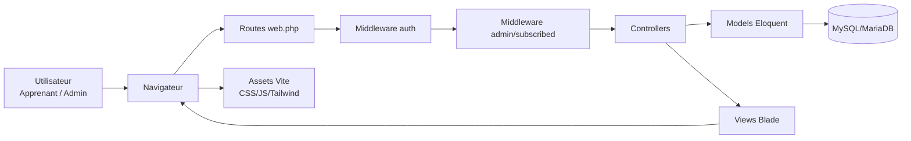

## E.2 Diagramme de cas d’utilisation (Use Case)

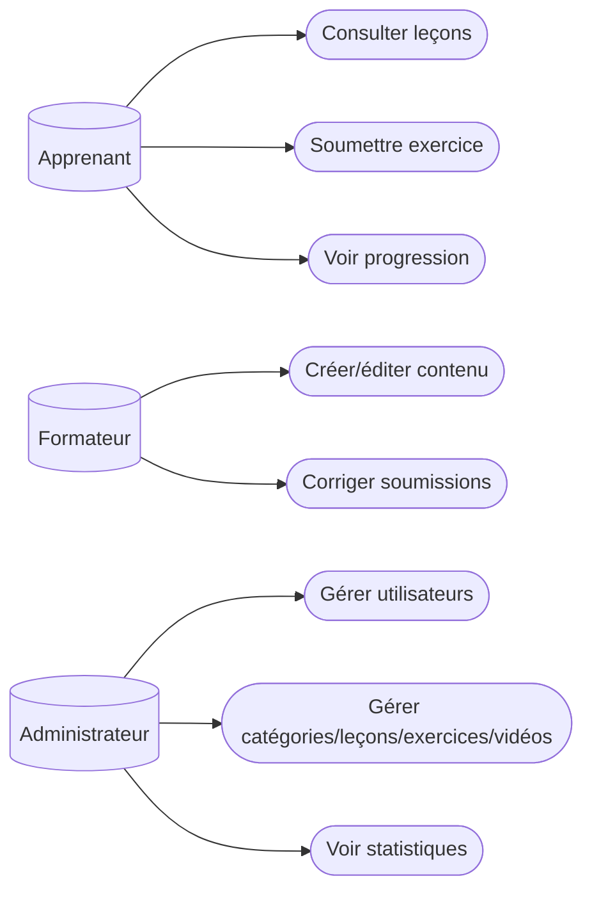

## E.3 Diagramme de classes UML (modèle métier principal)

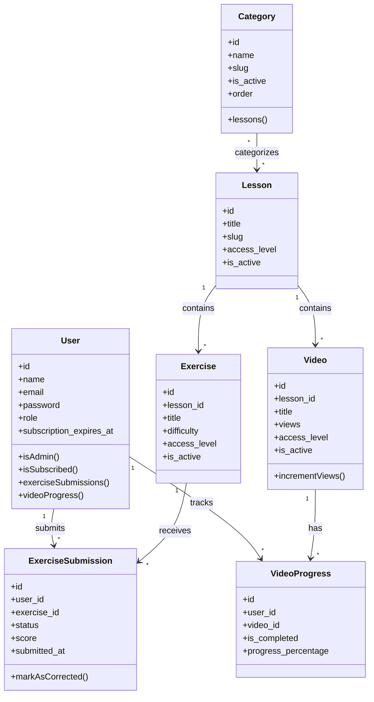

## E.4 Diagramme ER (MCD/MLD simplifié)

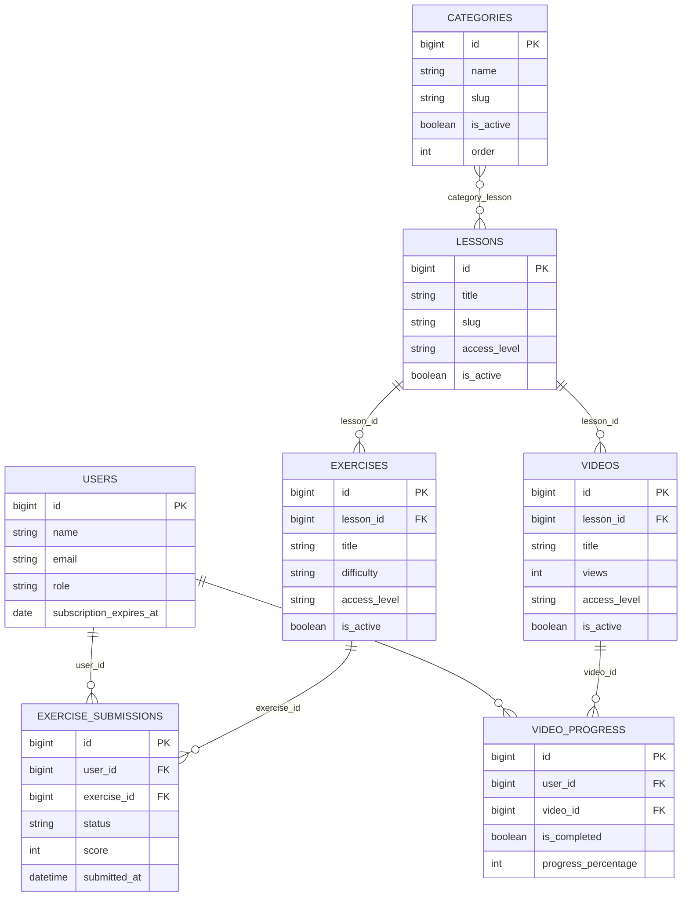

## E.5 Diagramme de séquence — Connexion admin

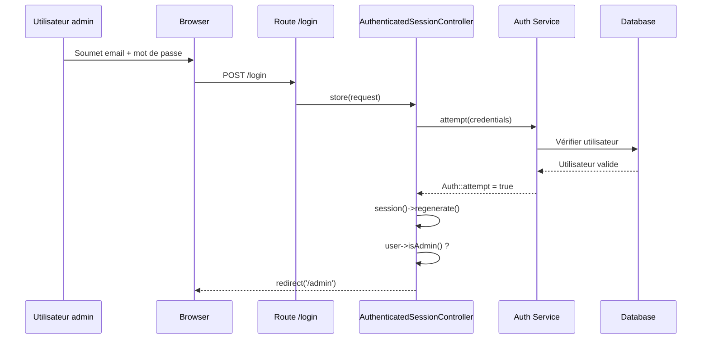

## E.6 Diagramme de séquence — Soumission d’exercice

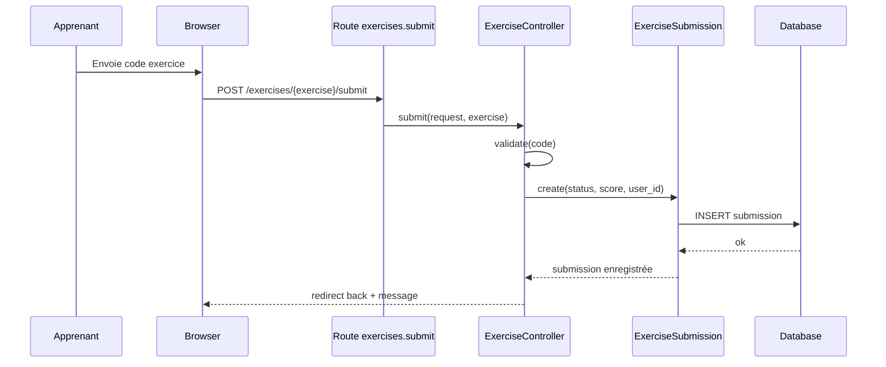

## E.7 Diagramme de séquence — Correction admin

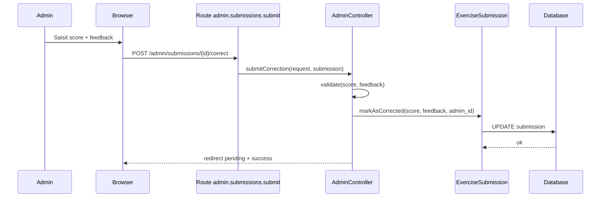

## E.8 Diagramme d’activité — Parcours apprenant

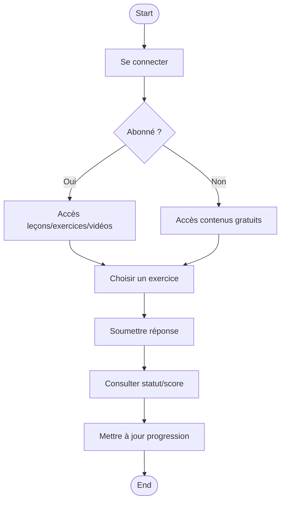

## E.9 Diagramme d’activité — Workflow admin contenu

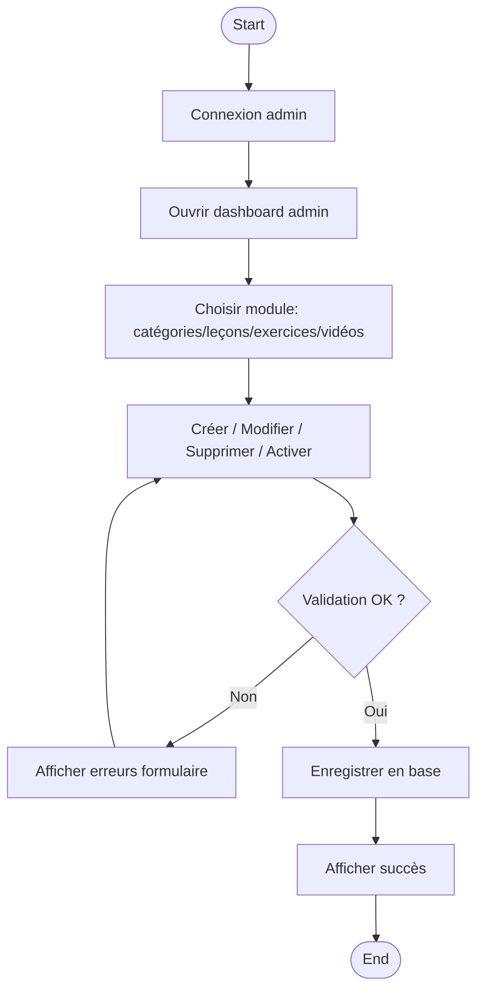

## E.10 Diagramme d’état — Entité soumission

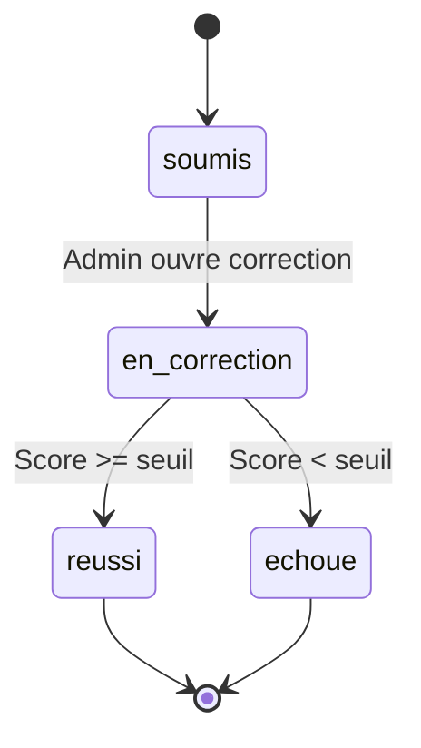

## E.11 Diagramme de déploiement (simplifié)

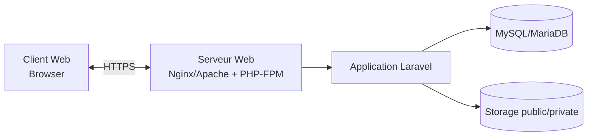

## E.12 Schéma des routes principales

```mermaid
flowchart LR
    P1[/ /] --> Home[HomeController@index]
    P2[/dashboard/] --> Dash[DashboardController@index]
    P3[/admin/] --> Adm[AdminController@index]
    P4[/admin/categories/] --> Cat[CategoryController@adminIndex]
    P5[/admin/statistics/] --> Stat[AdminController@statistics]
    P6[/exercises/{id}/submit/] --> ExSub[ExerciseController@submit]
```

## E.13 Schéma de navigation UI (responsive)

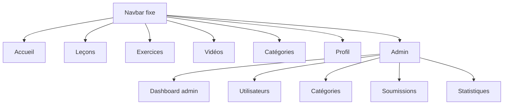

## E.14 Schéma de sécurité (middlewares)

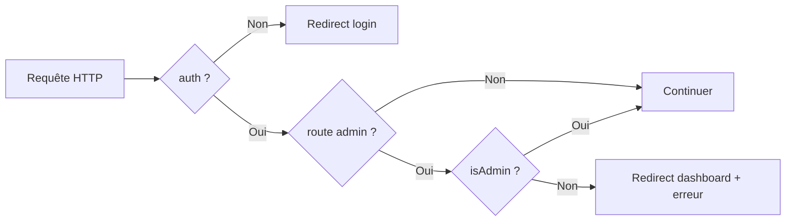

## E.15 Note d’intégration des schémas

- Ces diagrammes peuvent être exportés en PNG/SVG depuis un éditeur Mermaid (VS Code plugin, Mermaid Live Editor, ou pipeline docs).  
- Pour la version mémoire imprimée, placer chaque diagramme avec numéro de figure, légende et commentaire d’analyse.
- Recommandation : Figure E.1 à E.15 + renvoi croisé dans les sections de chapitre.
